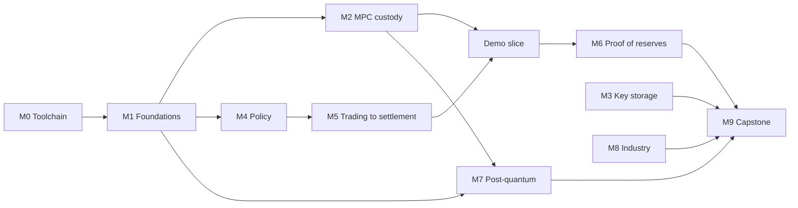

# Build plan

Depth target: a learning lab and showcase, not a research implementation. Each module delivers a
chapter PDF, one or more atlas entries, and a runnable piece of the demo, except the chapter-only
modules (3, 8, 9). Estimates are focused working days. They are rough, and they will be re-estimated
after Module 0.

## Order: thin end-to-end slice first

The demo runs end to end with simple parts by the end of Phase B. Phase C deepens each part. This
puts the showcase effect early and keeps each later module attached to something that already
runs.

## Phase A: toolchain and foundations

| Module | Delivers | Depends on | Days |
|--------|----------|------------|------|
| M0 Toolchain | **Done 2026-09-24.** Quarto and TinyTeX render the template to PDF. The PyO3 extension links `frost-secp256k1-tr` and builds on `uv sync`. Regtest starts, mines and stops. The Vite scaffold builds. Open: Mermaid in PDF needs `unzip` | none | 1 (took well under 1) |
| M1 Foundations | **Done 2026-09-24.** Educational secp256k1 arithmetic, ECDSA, Schnorr/BIP340, Shamir. Tests use the BIP340 test vectors and `cryptography` as oracles; Hypothesis property tests for Shamir. Chapter 1 renders | M0 | 3 (took under 1) |

## Phase B: the thin slice

| Module | Delivers | Depends on | Days |
|--------|----------|------------|------|
| M2 MPC custody | **Done 2026-09-24.** Python: 2-party ECDSA (Lindell 2017, from-scratch Paillier), FROST (RFC 9591 vectors), Pedersen DKG, refresh; backup as prose. Rust: PyO3 binding over `frost-secp256k1-tr` (DKG, commit, sign, aggregate), 2-of-3 signer processes. CGGMP as a chapter section with a `cggmp21` listing. Chapter 2 | M1 | 5 (took under 1) |
| M4 Policy | **Done 2026-09-24.** Default-deny engine: quorum approvals signed by approvers (Ed25519), destination whitelist, velocity limits in `Decimal` over an injected clock, hash-chained audit log. The engine issues a signed authorisation that signers verify against the FROST signing package's message. Chapter 4 | M1 | 2 (took under 1) |
| M5 Trading to settlement | **Done 2026-09-24.** FIX 5.0 SP2 over FIXT.1.1 with `simplefix` over asyncio TCP: Logon, NewOrderSingle, ExecutionReport. A toy exchange fills orders; fills net into a settlement batch; each instruction goes to policy, then signing, then regtest broadcast. Transactions and sighash are written from BIP 341 and pass its vectors. ClearLoop-style off-exchange settlement in the chapter. Chapter 5 | M4 | 2.5 (took under 1) |
| Demo slice | **Done 2026-09-27.** `demo/pipeline` runs the whole story (built with M5 and M6). `custody-lab run` prints it; `custody-lab serve` streams each run's events as NDJSON to a React dashboard showing each step and which process holds which share | M2, M5 | 3 (took under 1) |

## Phase C: deepen and complete

| Module | Delivers | Depends on | Days |
|--------|----------|------------|------|
| M6 Proof of reserves | Merkle-sum tree over client liabilities, per-client inclusion proofs, snapshot published after each settlement batch, assets read from regtest. zk proofs of liabilities as a chapter section, no code. Chapter 6 | Demo slice | 2 |
| M7 Post-quantum | ML-DSA and ML-KEM via `cryptography`. Lamport and WOTS+ from scratch as the hash-based teaching version; SLH-DSA library choice still open. Why lattice and hash-based schemes resist threshold signing; migration design (threshold PQ plus HSM fallback). Chapter 7 | M1, M2 | 2 |
| M3 Key storage | HSM vs MPC vs TEE (SGX, Nitro) comparison chapter, no code | none | 1 |
| M8 Industry and regulation | Tokenised funds and collateral, Canton, Kinexys, Agorá, mBridge, MiCA, qualified-custodian rules, SOC 2. Israeli landscape map and researchers. Every time-sensitive fact marked **verify current**. Chapter 8 | none | 2 |
| M9 Capstone | System design walkthrough in interview form, with the architecture diagram, trade-offs and failure modes | all | 1 |

Total: about 24.5 days (Phase A 4, Phase B 12.5, Phase C 8). Re-estimated after M0: no change to
the remaining modules, about 23.5 days. M0 settled the M2 build risk (the FROST crate compiles and
imports from Python). The largest open risk is now the Taproot transaction library for M5.

## Library status

| Library | Use | Status |
|---------|-----|--------|
| `cryptography` 50.0.1 | ECDSA verify oracle, Ed25519 approvals, ML-DSA, ML-KEM | Linked against OpenSSL 4.0.2. ML-DSA-44/65/87 and ML-KEM-768/1024 present, each with `from_seed_bytes`; no ML-KEM-512 and no SLH-DSA module (**observed**, 2026-09-25). ML-DSA-65 sign/verify (randomised signing; 1952-byte key, 3309-byte signature) and ML-KEM-768 encapsulate/decapsulate (1088-byte ciphertext) round trips **observed** |
| `frost-secp256k1-tr` 3.0.0 | Demo threshold signing | DKG and 2-of-3 signing across three processes; signatures verify with the independent BIP340 verifier (**observed**, `tests/mpc/test_signing_cluster.py`). Taproot tweak functions present, not yet used |
| `simplefix` 1.0.17 | FIX 5.0 SP2 encode/parse | computes BodyLength/CheckSum, parses incrementally (**observed**); ships no type information; last release 2023-09-12 |
| `quickfix` 1.16.0 | Not planned | sdist only on PyPI, compiles C++ at install (**observed**) |
| `quarto-cli` 1.10.18 | Manual rendering | installs under uv and renders the template to PDF with TinyTeX (**observed**); Mermaid needs headless Chrome, blocked on `unzip` |
| Bitcoin Core 31.1 | Regtest chain | SHA256 matched `SHA256SUMS` (GPG signature on that file not checked); start, mine to a bech32m address, stop (**observed**) |
| FastAPI, Typer, Hypothesis | Dashboard API, CLI, property tests | on PyPI (**observed**) |
| Taproot transactions | Build the regtest spend | written in `settlement/bitcoin.py` from BIP 341; all BIP 341 wallet vectors pass; Bitcoin Core accepts and mines the spends (**observed**) |
| SLH-DSA | Module 7 | **Chosen**: RustCrypto `slh-dsa` 0.1.0 via PyO3 (`rust/custody-pq`). It needs `signature = "=2.3.0-pre.4"`; cargo otherwise resolves 2.3.0-pre.7, which does not compile with it (**observed**). Its README states it has never been independently audited (**observed**). Key generation for all 12 parameter sets, verification and deterministic signing match the NIST ACVP vectors (**observed**, `tests/pq/test_pq_vectors.py`). Rejected: PyPI `slh-dsa` 0.2.5 (LGPL-3.0, single maintainer), `pqcrypto` 1.0.0 (empty on this platform), `pyspx` (pre-FIPS 205), `liboqs-python` (C build) |
| NIST ACVP vectors | Module 7 oracles | `usnistgov/ACVP-Server` `gen-val/json-files` has ML-DSA keyGen/sigGen/sigVer, ML-KEM keyGen/encapDecap, SLH-DSA keyGen/sigGen/sigVer and LMS. SLH-DSA keyGen gives skSeed, skPrf, pkSeed and the expected pk for all 12 parameter sets, 10 cases for SHA2-128f (**observed**) |

## Quality gates per module

- `uv run pytest`, `uv run ruff check`, `uv run mypy` pass.
- The chapter renders with `error: false`, so every code cell in the PDF has run.
- Every educational implementation has an external oracle: a test vector set or an independent
  verifier.
- The atlas entries for the module exist and are linked from `atlas/index.md`.
