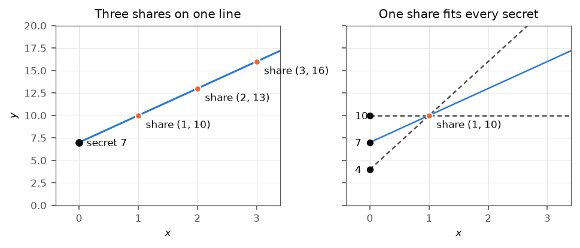

# Orientation: One Settlement, End to End

2026-10-08

[All chapters](../README.md) \| Next: [Chapter 1,
Foundations](01-foundations.md)

<a id="what-this-chapter-is-for"></a>

## What this chapter is for

This manual explains how an institution can hold bitcoin for its clients
in such a way that no single person and no single computer is able to
move those coins. It does this through one working demo: a small but
complete custody system that runs on one computer. The demo takes a
client’s trades on an exchange and works out what the client owes.
People approve the payment, and a key split across three separate
programs signs it. The payment goes to a private Bitcoin network, and
the custodian then publishes evidence that it still holds every coin its
clients are owed.

This chapter follows that one payment from start to finish. It assumes
no knowledge of cryptography or of Bitcoin, and it uses school
arithmetic only. Each idea is explained in plain words before it is
used, and wherever a number appears, the arithmetic is written out so
that it can be checked by hand. The code cells in the chapter ran when
the PDF was built; the numbers they print are the numbers the demo uses.
Later chapters return to each idea and give the full mechanism.

Each new term is printed in **bold** at the place where it is explained,
and is also listed in [the glossary](../../atlas/glossary.md) with the
chapter that teaches it in full.

By the end of this chapter the following should be clear:

- why holding bitcoin for someone else is a different problem from
  holding money or securities for them;
- what a key, a signature and a transaction are, and why whoever
  controls the key controls the coins;
- how a key can be split into pieces so that no machine ever holds it,
  and how the pieces can still produce a signature;
- how people approve a payment before any machine signs it, and why the
  people and the machines are kept apart;
- how a custodian can show publicly that it holds what it owes;
- what each of the demo’s nine steps does, and which chapter explains
  it.

<a id="what-a-custodian-does"></a>

## What a custodian does

A **custodian** holds assets on behalf of other people. In traditional
finance a custodian bank holds shares and bonds for pension funds, asset
managers and other institutions. The client’s ownership is a record: an
entry in the custodian’s books, mirrored in the books of a central
securities depository. If a clerk keys a transfer to the wrong account,
the depository’s records can be corrected. If a transfer was fraudulent,
a court can order it reversed. The record is the asset, and the record
is kept by institutions that are able to change it.

Bitcoin has no such institutions. There is no depository, no operator
and no help desk. The record of who owns which coins is kept by
thousands of independent computers that all apply the same rules, and
those rules contain no procedure for reversing a payment. A payment that
the network has accepted stays accepted, whoever made it and for
whatever reason.

A bitcoin custodian’s job therefore narrows to one question that a
custodian bank never has to ask in this form: who is able to make a
payment out of the client’s coins, and under what conditions. The next
section explains what “able to make a payment” means on Bitcoin. The
sections after it show how the demo controls it.

<a id="bitcoin-in-five-ideas"></a>

## Bitcoin in five ideas

<a id="a-ledger-that-nobody-operates"></a>

### A ledger that nobody operates

A **ledger** is a record of who owns what. A bank’s ledger is a database
inside the bank, and the bank decides what is written into it. Bitcoin’s
ledger is a public record that anyone may download, and many thousands
of computers, called **nodes**, each keep a full copy of it. When a new
payment is announced, every node checks it against the same fixed rules.
A payment that breaks a rule is rejected by every node independently.
There is no central server through which a payment could be forced, and
no central server from which an accepted payment could be deleted.

The rule that matters for custody is the rule that decides who may spend
a coin. It rests on keys and signatures.

<a id="keys-a-private-half-and-a-public-half"></a>

### Keys: a private half and a public half

Bitcoin’s keys come in pairs of two linked numbers. The **private key**
is a large random number that its owner keeps secret. The **public key**
is calculated from the private key by a fixed procedure, and it can be
shown to anyone. The procedure works in one direction only. Computing
the public key from the private key takes a fraction of a millisecond.
Computing the private key from the public key has no known method faster
than about $2^{128}$ steps for Bitcoin’s keys, a number with 39 digits,
far beyond any computer that exists. [Chapter 7](07-post-quantum.md)
explains what a future quantum computer would change about this.

An engineer who has connected a trading system to a modern exchange’s
REST API has already used a key pair. The exchange issues an RSA key
pair for each API key. The private half stays in a file on the client’s
server, readable only by its owner, and the exchange keeps the public
half. The client signs every request with the private half, and the
exchange checks each signature with the public half before it acts on
the request.

Bitcoin works the same way, with one difference, and custody exists
because of that difference. At the exchange, the public key is
registered against an account, and staff at the exchange can freeze that
account, revoke the key, issue a new one and reverse what a stolen key
did. On Bitcoin, the public key is the account. There is nobody to call,
nothing to revoke, and no other credential that proves ownership.

Bitcoin’s keys are not RSA keys. They are built from elliptic-curve
arithmetic, which gives the same strength with much smaller numbers: a
Bitcoin private key is 32 bytes. [Chapter 1](01-foundations.md) builds
that arithmetic from the beginning. This chapter needs only the one-way
property.

Coins are held at an **address**, a short text string derived from a
public key. On the private test network that the demo uses, the demo’s
custody address starts `bcrt1p`. Paying someone means sending coins to
their address. Spending coins held at an address requires a signature
made with the matching private key.

<a id="signatures"></a>

### Signatures

A **digital signature** is a number calculated from two inputs: a
private key, and the exact bytes of a message. Anyone who has the
matching public key can check that the signature fits the message. The
check answers two questions at once. Was the signature made by whoever
holds the private key? Is the message exactly the one that was signed?
Changing a single byte of the message, such as one digit of an amount,
makes the check fail. And nobody without the private key can produce a
signature that passes, even after seeing any number of valid signatures
on other messages.

The cell below shows these properties in running code. It uses Ed25519,
a widely used signature scheme, which the demo uses for the approvals
that people give. Bitcoin itself uses a related scheme, the Schnorr
signature, built on Bitcoin’s own curve; [chapter 1](01-foundations.md)
builds it. The cell signs a payment instruction, checks the signature,
and then checks the same signature against an altered amount and against
another person’s public key.

``` python
from cryptography.exceptions import InvalidSignature
from cryptography.hazmat.primitives.asymmetric.ed25519 import Ed25519PrivateKey


def verifies(public_key, signature, message):
    try:
        public_key.verify(signature, message)
        return True
    except InvalidSignature:
        return False


private_key = Ed25519PrivateKey.generate()
public_key = private_key.public_key()
message = b"pay 0.85 BTC to the exchange settlement address"
signature = private_key.sign(message)
print(f"signature: {len(signature)} bytes, beginning {signature[:8].hex()}")

assert verifies(public_key, signature, message)
print("original message:          signature accepted")

altered = b"pay 8.50 BTC to the exchange settlement address"
assert not verifies(public_key, signature, altered)
print("amount altered:            signature rejected")

someone_else = Ed25519PrivateKey.generate().public_key()
assert not verifies(someone_else, signature, message)
print("another person's key:      signature rejected")
```

    signature: 64 bytes, beginning ced6b75a7ecbc3a4
    original message:          signature accepted
    amount altered:            signature rejected
    another person's key:      signature rejected

The first printed line shows that a signature is ordinary data: 64
bytes, which look random and are different every time the cell runs,
because each run generates a new key. The second line is the normal
case. The third line is the protection that matters for payments: moving
the decimal point in the amount turns a valid signature into an invalid
one, so a signed instruction cannot be edited after signing. The fourth
line shows that a signature belongs to one key pair. Checked against
anyone else’s public key, it fails.

<a id="fingerprints-hash-functions"></a>

### Fingerprints: hash functions

A **hash function** turns an input of any length into an output of fixed
length. SHA-256, the hash function Bitcoin uses, always produces 32
bytes. The output works as a fingerprint of the input:

- the same input always produces the same fingerprint;
- any change to the input, however small, produces an unrelated
  fingerprint;
- no known method can find two different inputs with the same
  fingerprint, or an input that produces a given fingerprint.

``` python
import hashlib

for text in ["pay 0.85 BTC to the exchange", "pay 0.86 BTC to the exchange"]:
    fingerprint = hashlib.sha256(text.encode()).hexdigest()
    print(f"{text}  ->  {fingerprint[:24]}...")
```

    pay 0.85 BTC to the exchange  ->  9657c3fe054adf1e5c30f4bc...
    pay 0.86 BTC to the exchange  ->  8122d8b89e6fb0caf7629382...

The two inputs differ in one digit, and their fingerprints share no
visible pattern. The printed fingerprints are the first 24 of 64
hexadecimal characters.

Fingerprints let a short value stand for a long one. In Bitcoin, the
signature on a transaction covers a 32-byte fingerprint of that
transaction, called its **sighash**. Two more parts of the demo depend
on fingerprints: the permission that tells the signing machines which
transaction they may sign (the policy section below), and the
proof-of-reserves tree (the reserves section).

<a id="transactions-blocks-and-confirmation"></a>

### Transactions, blocks and confirmation

A **transaction** is a signed message that moves coins. It names the
coins it spends, lists where they go with an amount for each
destination, and carries a signature for the coins it spends.

Bitcoin does not keep a balance for each address, the way a bank keeps a
balance for each account. It keeps a list of individual coins, each of a
fixed amount and each locked to an address. Such a coin is called a
**UTXO**, short for unspent transaction output. A UTXO is always spent
whole. To pay 0.85 BTC out of a 5.00 BTC coin, a transaction spends the
entire 5.00 BTC coin and creates two new coins: 0.85 BTC locked to the
payee’s address, and the remainder, called **change**, locked back to
the payer’s own address. The total of the new coins is slightly less
than the coin spent. The difference is the **fee**, which goes to
whoever includes the transaction in the ledger.

Nodes collect valid transactions and group them into a **block**. Each
block contains the fingerprint of the block before it, so the blocks
form a chain. Changing a transaction in an old block would change that
block’s fingerprint, which would break the link from the next block, and
from every block after it. On the public network, producing a block
requires finding, by trial and error, a value that gives the block a
fingerprint below a target. The whole network takes about ten minutes
per block to find one. This is called **proof of work**, and it is what
makes rewriting history expensive: an attacker would have to redo the
work for the altered block and for every block on top of it, faster than
the rest of the network adds new ones.

A transaction that has been included in a block has one
**confirmation**. Every later block adds one more. The network never
declares a payment final. Each additional block makes reversal more
expensive, and each institution chooses how many confirmations it treats
as final for a given amount.

The demo never touches the public network. It runs **regtest**, a
private Bitcoin network that exists only on the computer running the
demo. Regtest runs Bitcoin Core, the standard Bitcoin software, and
checks transactions and signatures by the same rules as the public
network. It differs in two ways: blocks are produced instantly on
command, and the coins have no value.

<a id="what-follows-from-the-five-ideas"></a>

### What follows from the five ideas

Taken together: coins are locked to an address, the address comes from a
public key, and spending the coins requires a signature from the
matching private key. Once a payment is in the chain, nobody can recall
it. Whoever can produce that signature controls the coins, whether that
is the client, the custodian, an employee or a thief who copied a file.

A custodian protects client coins by controlling two things: who is able
to produce a signature with the custody key, and which payments that
signature may be used for.

<a id="four-ways-client-coins-are-lost"></a>

## Four ways client coins are lost

Every control in the demo exists to prevent one of four failures.

**The key is stolen.** The private key is a 32-byte number. If it is
stored in a file, or held in the memory of one server, anyone who gets
onto that server can copy it. That includes an attacker who exploits a
software flaw and an employee with administrator rights. A copied key
can be used from anywhere, at any time, and the theft may go unnoticed
until the coins move. The demo’s answer is that the whole key never
exists on any machine. It is created in pieces and used in pieces. The
next section explains how, and [chapter 2](02-mpc-custody.md) gives the
full protocols.

**The key is lost.** If the only copy of the key is destroyed, the coins
are locked forever, because no authority can issue a replacement. A disk
fails, a data centre burns, or the one person who knew a passphrase
leaves. The demo’s answer is that the key is split into three pieces
held by three separate programs, and any two of them can sign. One piece
can be lost without losing the coins. [Chapter 2](02-mpc-custody.md)
also covers backing up and replacing pieces.

**The key signs the wrong payment.** The key can be perfectly protected
and still sign a payment that should never happen. An insider raises a
payment to their own address, or a compromised server submits a
fraudulent one. Protecting the key does nothing here, because the key is
working as designed. The demo’s answer is a policy engine: a program
that refuses every payment it has not been configured to allow, requires
named people to approve each payment with their own signatures, and
hands the signing machines a signed permission naming the one
transaction they may sign. [Chapter 4](04-policy.md) covers it.

**The custodian does not hold what it reports.** The custodian’s books
may say that clients are owed 5 BTC while the custody address holds
less, because coins were lent out, lost or taken. Clients cannot see the
custodian’s books. The demo’s answer is a proof of reserves. After each
batch of payments the custodian publishes the total it owes, in a form
that lets every client check that its own balance was counted. The
publication also carries a signature showing that the custodian controls
the coins on the chain. [Chapter 6](06-reserves.md) covers it.

| Failure | Control in the demo | Chapter |
|----|----|----|
| The key is stolen | The whole key never exists: it is created and used in pieces | 2 |
| The key is lost | Any 2 of the 3 pieces can sign | 2 |
| The key signs the wrong payment | Default-deny policy engine, signed approvals, an authorisation the signers check | 4 |
| The custodian does not hold what it reports | Proof of reserves after every settlement batch | 6 |

<a id="splitting-a-key-so-that-nobody-holds-it"></a>

## Splitting a key so that nobody holds it

<a id="copies-make-theft-easier"></a>

### Copies make theft easier

The obvious protection against losing a key is to make copies, but each
copy is one more place from which the key can be stolen. The obvious
protection against theft is to keep a single copy in one well-guarded
place, but a single copy can be lost. The two failures pull in opposite
directions. Splitting the key is how custody systems escape that
trade-off.

<a id="pieces-of-a-secret-a-line-through-two-points"></a>

### Pieces of a secret: a line through two points

**Secret sharing** splits a secret number into pieces, called
**shares**, so that a set number of shares recovers the secret and any
smaller number reveals nothing about it. That set number is the
**threshold**, and a scheme where any $t$ of $n$ shares suffice is
called $t$-of-$n$. The demo’s key splitting rests on Shamir’s scheme,
and its 2-of-3 case can be drawn.

Take a secret number, 7. Draw a straight line that crosses the vertical
axis at 7, with a slope picked at random; here the slope is 3. The line
is $y = 7 + 3x$. The three shares are three points on that line, at
$x = 1$, $2$ and $3$:

| Holder | $x$ | $y = 7 + 3x$ | Share     |
|--------|-----|--------------|-----------|
| 1      | 1   | $7 + 3 = 10$ | $(1, 10)$ |
| 2      | 2   | $7 + 6 = 13$ | $(2, 13)$ |
| 3      | 3   | $7 + 9 = 16$ | $(3, 16)$ |

**Any two holders can recover the secret.** Two points fix a straight
line, and the secret is the height at which that line crosses the
vertical axis, where $x = 0$. Take holders 1 and 3. Between their points
the line rises from 10 to 16 while $x$ goes from 1 to 3, so the slope is
$(16 - 10) / (3 - 1) = 3$. Stepping back from $x = 1$ to $x = 0$
subtracts one slope: $10 - 3 = 7$. Holders 1 and 2, or 2 and 3, get the
same answer by the same steps.

**One holder alone learns nothing.** Through the single point $(1, 10)$
passes one line for every possible secret. A line through it with slope
6 crosses the axis at 4; with slope 3, at 7; with slope 0, at 10. One
point is consistent with every secret, so holding one share gives no
reason to prefer any secret over another. The figure shows both cases.

<div id="fig-line-shares">



Figure 1: Left: the three shares lie on one line, which crosses the
vertical axis at the secret, 7. Any two of the points fix the line.
Right: holder 1’s share alone. Lines through $(1, 10)$ cross the axis at
4, 7 and 10, and at every other height, so one share says nothing about
the secret.

</div>

The cell below recovers the secret from every pair of shares, using
exact fractions so that no rounding is involved:

``` python
from fractions import Fraction

secret, slope = 7, 3
shares = {x: secret + slope * x for x in (1, 2, 3)}
print("shares:", shares)


def recover(xa, ya, xb, yb):
    line_slope = Fraction(yb - ya, xb - xa)  # rise over run
    return ya - line_slope * xa              # step back to x = 0


for a, b in [(1, 2), (1, 3), (2, 3)]:
    found = recover(a, shares[a], b, shares[b])
    assert found == secret
    print(f"holders {a} and {b} recover {found}")
```

    shares: {1: 10, 2: 13, 3: 16}
    holders 1 and 2 recover 7
    holders 1 and 3 recover 7
    holders 2 and 3 recover 7

The picture simplifies in two ways. First, the real scheme uses
arithmetic on a clock (modular arithmetic, [chapter
1](01-foundations.md)), in which numbers wrap around instead of growing.
On a clock one share is equally consistent with every possible secret.
Over ordinary numbers, the random slope has to come from some limited
range, and one share then narrows down where the secret can lie. Second,
a threshold larger than 2 needs a curve rather than a line: three points
fix a parabola, so 3-of-$n$ sharing puts the shares on a parabola.

<a id="the-place-where-the-pieces-meet"></a>

### The place where the pieces meet

Secret sharing protects a key while it is stored. The three shares can
sit in three places; any one of them can be lost, and any one of them is
useless to a thief. Secret sharing alone does not protect the key while
it is used. To sign, the shares must be brought together and the key
rebuilt, and wherever that happens, the whole key sits in one machine’s
memory for as long as the signing takes. An attacker who controls that
machine at that moment gets the key. A system that rebuilds its key for
every payment has moved its single point of failure, not removed it.

This is how most hardware key ceremonies work. A key held inside a
hardware security module is backed up as shares on smart cards held by
different officers, and the cards are brought together to restore the
key inside the module. The module is the place where the pieces meet,
and the design trusts it to be that place. [Chapter
3](03-key-storage.md) compares that approach with the one this demo
uses.

<a id="signing-with-pieces-threshold-signing"></a>

### Signing with pieces: threshold signing

**Threshold signing** removes the meeting place. Each holder computes a
**partial signature** from its own share, without seeing any other
share. The partial signatures are then combined into one ordinary
signature, and that signature checks out against the ordinary public
key. Nobody computes the key itself, at any point.

This is possible because of the way a Schnorr signature is calculated.
In simplified form it is

$$
s = k + e \times d,
$$

where $d$ is the private key, $k$ is a fresh secret random number used
for this one signature, called the **nonce**, and $e$ is a number
calculated from the fingerprint of the message. The calculation only
multiplies the key by a known number and adds another number.
Calculations of that kind can be done piece by piece, because of a
property of the line picture.

On a line, the secret is a fixed weighted sum of any two shares. From
holders 1 and 3: $1.5 \times 10 - 0.5 \times 16 = 15 - 8 = 7$. The
weights, $1.5$ and $-0.5$, depend only on which holders take part
($x = 1$ and $x = 3$), never on the secret. For holders 1 and 2 they are
$2$ and $-1$ ($2 \times 10 - 13 = 7$). For holders 2 and 3 they are $3$
and $-2$ ($3 \times 13 - 2 \times 16 = 7$). Each weight is a **Lagrange
coefficient**, and [chapter 1](01-foundations.md) gives the formula.
Because the weights do not depend on the secret, any two holders can
apply them to their own partial results, and the weighted sum of the
partial results equals the result that the whole key would have given.

A worked example, with every number small enough to check by hand:

- The private key is $d = 7$, shared on the line $7 + 3x$: shares 10,
  13, 16, as before.
- The nonce is $k = 4$, shared on its own line $4 + 2x$: nonce shares 6,
  8, 10.
- The number from the message is $e = 5$.

With the whole key, the signature would be $s = 4 + 5 \times 7 = 39$.

Signers 1 and 3 never see 7 or 4. Each uses only its own two shares:

- signer 1: $6 + 5 \times 10 = 56$;
- signer 3: $10 + 5 \times 16 = 90$.

The **coordinator**, the program that collects partial signatures and
combines them, applies the weights for holders 1 and 3:
$1.5 \times 56 - 0.5 \times 90 = 84 - 45 = 39$. That is the same
signature the whole key would have produced. Signer 1 used the numbers
10 and 6, signer 3 used 16 and 10, and the coordinator saw 56 and 90.
The key, 7, and the nonce, 4, were never calculated by anyone.

``` python
key, key_slope = 7, 3          # the whole key: no signer is ever given it
nonce, nonce_slope = 4, 2      # the whole nonce: no signer is ever given it
e = 5                          # the number calculated from the message
key_share = {x: key + key_slope * x for x in (1, 2, 3)}
nonce_share = {x: nonce + nonce_slope * x for x in (1, 2, 3)}


def weight(i, other):
    """Lagrange coefficient of holder i when holder `other` is the second signer."""
    return Fraction(0 - other, i - other)


whole = nonce + e * key
print(f"with the whole key: s = {nonce} + {e} x {key} = {whole}")
for a, b in [(1, 3), (1, 2), (2, 3)]:
    partial = {i: nonce_share[i] + e * key_share[i] for i in (a, b)}
    combined = weight(a, b) * partial[a] + weight(b, a) * partial[b]
    assert combined == whole
    print(f"signers {a} and {b}: partials {partial[a]} and {partial[b]}, "
          f"weights {float(weight(a, b)):g} and {float(weight(b, a)):g}, "
          f"combined {combined}")
```

    with the whole key: s = 4 + 5 x 7 = 39
    signers 1 and 3: partials 56 and 90, weights 1.5 and -0.5, combined 39
    signers 1 and 2: partials 56 and 73, weights 2 and -1, combined 39
    signers 2 and 3: partials 73 and 90, weights 3 and -2, combined 39

Every pair of signers produces 39, the signature of the whole key, from
different partial signatures.

The real protocol, **FROST**, does the same thing with three additions,
and [chapter 2](02-mpc-custody.md) explains each of them:

- the arithmetic runs on a clock with 78-digit numbers, so a partial
  signature reveals nothing about the share inside it;
- a real Schnorr signature also contains a public value derived from the
  nonce, which the signers must build together before $e$ can be
  calculated, so signing takes two rounds of messages;
- in the first round each signer commits to its nonce share before
  seeing anyone else’s, which stops a dishonest signer from choosing its
  nonce after seeing the others.

**Why the nonce must never repeat.** If one nonce $k$ is used to sign
two different messages, the two signatures form two equations,
$s_1 = k + e_1 d$ and $s_2 = k + e_2 d$. There are two unknowns, $k$ and
$d$, and anyone holding both signatures can solve for them. Subtracting
the second equation from the first removes $k$:
$s_1 - s_2 = (e_1 - e_2)\,d$.

``` python
k, d = 4, 7                        # nonce and key, both secret
e1, e2 = 5, 2                      # two different messages
s1, s2 = k + e1 * d, k + e2 * d    # two signatures made with the same nonce
recovered = (s1 - s2) // (e1 - e2)
assert recovered == d
print(f"s1 = {s1}, s2 = {s2}, key = ({s1} - {s2}) / ({e1} - {e2}) = {recovered}")
```

    s1 = 39, s2 = 18, key = (39 - 18) / (5 - 2) = 7

Two signatures and school algebra give up the private key. This is why
every signing protocol in the manual specifies exactly how nonces are
generated, and why a signer in the demo discards its nonce share before
it checks a request, even if the request is then refused.

<a id="creating-the-key-in-pieces"></a>

### Creating the key in pieces

If the key were created whole and then split, it would exist whole at
least once, on the machine that did the splitting. **Distributed key
generation** (**DKG**) avoids that moment. Each of the three signers
picks its own random line and sends every other signer one point on it.
Each signer adds up the points it receives, together with its own, and
the sum is its share. The key that these shares belong to is the sum of
the three lines’ starting points, a number that no signer ever learns,
because each one knows only its own starting point.

With small numbers, the three signers’ lines can be chosen to add up to
the line used above:

| Signer             | Its own line | Value at $x = 1$ | at $x = 2$ | at $x = 3$ |
|--------------------|--------------|------------------|------------|------------|
| 1                  | $2 + 1x$     | 3                | 4          | 5          |
| 2                  | $1 + 4x$     | 5                | 9          | 13         |
| 3                  | $4 - 2x$     | 2                | 0          | -2         |
| Share (column sum) | $7 + 3x$     | 10               | 13         | 16         |

``` python
lines = {1: (2, 1), 2: (1, 4), 3: (4, -2)}  # each signer's (starting point, slope)
for x in (1, 2, 3):
    received = [start + slope * x for start, slope in lines.values()]
    print(f"signer {x} adds {' + '.join(map(str, received))} "
          f"= share {sum(received)}")
    assert sum(received) == key_share[x]
assert sum(start for start, _ in lines.values()) == key
```

    signer 1 adds 3 + 5 + 2 = share 10
    signer 2 adds 4 + 9 + 0 = share 13
    signer 3 adds 5 + 13 + -2 = share 16

Each signer ends up with the same share it had in the earlier example
(10, 13 and 16), and the key those shares belong to is $2 + 1 + 4 = 7$.
No signer knows all three starting points, so no signer can calculate 7.
Each signer also publishes a public value for its own starting point, in
the form of a public key, and adding the three public values gives the
public key of the whole key. That way everyone learns the custody
address and nobody learns the private key. [Chapter
2](02-mpc-custody.md) explains how each signer checks that the points it
received really lie on a line, so a cheating signer is caught.

In the demo, three separate operating-system processes run DKG through
the Zcash Foundation’s FROST library, written in Rust. Each process ends
up holding one share and nothing else.

<a id="deciding-which-payments-happen-policy"></a>

## Deciding which payments happen: policy

The signing machines answer the question “can the key sign?”. Something
else has to answer the question “should this payment happen?”. In the
demo that is the **policy engine**, a program that receives each payment
request and decides whether it may go ahead. A payment request here is a
settlement instruction: pay this amount of this asset to this address,
raised by a named person.

<a id="default-deny"></a>

### Default deny

The policy engine is **default-deny**: a payment is refused unless every
rule allows it. An instruction for an asset with no policy is refused.
So is an instruction to an address that is not on the list, or for an
amount larger than the largest amount the rules mention. The demo’s
policy for bitcoin contains these rules:

- **Whitelist.** The destination must be on the list of approved
  addresses. In the demo the list holds one address, the exchange’s
  settlement address.
- **Amount tiers.** Up to 0.1 BTC needs one approval; above 0.1 BTC and
  up to 10 BTC needs two; above 10 BTC is refused outright.
- **Velocity limit.** No more than 20 BTC may be authorised in any
  24-hour period, counting what was already authorised.
- **Once only.** An instruction that was authorised before is refused.
- **Four-eyes.** Approvals count only if they come from registered
  approvers, and the person who raised the instruction cannot approve
  it.

The closest counterpart in trading infrastructure is the pre-trade risk
check in a FIX gateway. An order that fails a check is rejected before
it reaches the exchange. The comparison breaks at one point: an
erroneous trade can sometimes be cancelled by the exchange afterwards,
while a confirmed payment cannot be cancelled by anyone. A policy engine
cannot rely on catching mistakes later, so it refuses everything it has
not been configured to allow.

<a id="approvals-are-signatures"></a>

### Approvals are signatures

Each approver has an Ed25519 key pair, like the one in the signature
cell above. To approve an instruction, the approver signs the
instruction’s fingerprint. The policy engine holds each approver’s
public key and checks each approval against it. Three consequences
follow:

- an approval cannot be forged by someone who edits a database row,
  because the forger would need the approver’s private key;
- an approval for 0.85 BTC cannot be reused for 8.5 BTC, because the two
  instructions have different fingerprints;
- anyone holding the approvals can check afterwards who approved what,
  because every approval is a signature.

In the demo, a desk account called ops-desk raises the instruction. With
bob’s approval alone the engine answers PENDING, with the reason “1 of 2
required approvals”. With bob’s and carol’s it answers APPROVED. Every
decision is written to an audit log in which each record contains the
fingerprint of the record before it, so editing any old record changes
every later fingerprint and the edit shows.

<a id="the-authorisation-permission-for-one-transaction"></a>

### The authorisation: permission for one transaction

An approval says “this instruction may proceed”. The signing machines
need something narrower: “this exact transaction may be signed”. When
the instruction is approved, the policy engine issues an
**authorisation**, a short message signed by the engine that contains:

- the sighash, the 32-byte fingerprint of the exact transaction to be
  signed;
- a reference to the approved instruction;
- a unique identifier;
- an expiry time, 60 seconds after issue.

The engine signs each authorisation twice, with Ed25519 and with
ML-DSA-65, and a signer accepts it only if both signatures check out.
ML-DSA-65 is designed to resist quantum computers; [chapter
7](07-post-quantum.md) explains why both are used.

Before a signer contributes a partial signature, it checks the
authorisation itself: both signatures are the policy engine’s, the
authorisation has not expired, it has not been used before, and the
fingerprint it names is exactly the fingerprint the signer is being
asked to sign.

The checks run inside each signer because of the coordinator. The
coordinator is the program that passes messages between the signers and
asks them to sign. If it were compromised, it could ask them to sign
anything. Because each signer checks for itself, a compromised
coordinator can only obtain signatures for transactions that people
approved.

<a id="two-quorums"></a>

## Two quorums

A **quorum** is the minimum number of members of a group who must take
part for a decision to count. The demo has two quorums, and keeps them
apart on purpose.

- The **approval quorum** is made of people. It answers “should this
  payment happen?”. In the demo it is bob and carol, two approvals out
  of the registered approvers, counted by the policy engine.
- The **signing quorum** is made of machines. It answers “can the key
  sign?”. In the demo it is signers 1 and 3, two out of the three
  processes that hold key shares.

The only link between them is the authorisation. The people never touch
a key share. The signers never decide whether a payment is justified;
they only check that someone with the authority to decide has done so.

Keeping them apart limits what each compromise gives an attacker:

| What the attacker controls | What it gives the attacker |
|----|----|
| The coordinator | Nothing it can spend: every signer refuses a transaction without an authorisation for it |
| One signer | One share, which cannot sign alone |
| One approver’s key | One approval; payments above 0.1 BTC still need a second person |
| Two signers | The threshold. The authorisation check runs inside the signers, so an attacker who runs two of them can skip it and sign anything |

The last row is the reason the signer machines must not share an
administrator. If one person, or one stolen administrator password, can
reach two signers, the threshold protects nothing. [Chapter
9](09-capstone.md) sets out the same analysis for every component of a
production deployment.

<a id="showing-that-the-coins-are-there-proof-of-reserves"></a>

## Showing that the coins are there: proof of reserves

<a id="the-problem"></a>

### The problem

A client of a custodian sees a balance in a report or on a screen. That
balance is a line in the custodian’s private books. Nothing in the
report proves that the custodian actually holds the coins. Several
exchange and lender failures have ended with client balances exceeding
the coins held; FTX, which collapsed in November 2022, is the best-known
case.

A **proof of reserves** answers the question “does the custodian hold at
least what it owes?” with evidence that anyone can check. It has two
halves: what the custodian holds (its assets), and what it owes (its
liabilities).

<a id="assets-coins-on-a-public-chain"></a>

### Assets: coins on a public chain

The assets half is the easy one, because Bitcoin’s ledger is public.
Anyone can look up how many coins are held at the custody address. What
a lookup cannot show is that the custodian controls that address, rather
than quoting someone else’s. The custodian shows it by signing a fresh
statement with the custody key, which only the holder of that key can
do. That signature is a **proof of control**.

<a id="liabilities-a-tree-of-totals"></a>

### Liabilities: a tree of totals

The liabilities half is harder. The total owed to clients lives in the
custodian’s private books. Publishing only the total proves nothing: the
custodian could leave clients out, or understate their balances, and
nobody could tell. Publishing every client’s balance would expose every
client.

The **Merkle sum tree** solves both problems. It works like this:

1.  Each client’s balance becomes a leaf: the balance, together with a
    fingerprint of the client’s identifier, the balance and a random
    value called a **salt**. The salt stops anyone from guessing a
    client’s balance by trying values until the fingerprint matches.
2.  The leaves are paired. Each pair gets a parent node, which records
    the sum of its two children’s balances and a fingerprint of both
    children, sums included.
3.  The pairing repeats, level by level, until one node is left: the
    **Merkle root**, or simply the root. The root’s sum is the total
    owed to all clients.

The custodian publishes the root. Each client receives its own
**inclusion proof**: the nodes next to its path from its leaf to the
root, one per level. With them the client recomputes the path. It adds
its balance to its neighbour’s, fingerprints the pair, and repeats up to
the top. If the result matches the published root, the client’s balance
was counted in the published total, at its true value.

Before settlement, the demo’s four clients hold the following, sorted by
name as the tree sorts them:

| Client         | Balance (BTC) |
|----------------|---------------|
| alpha-capital  | 2.00          |
| beta-fund      | 1.50          |
| delta-trading  | 0.50          |
| gamma-treasury | 1.00          |

The leaves pair as alpha with beta and delta with gamma. The two parents
record $2.00 + 1.50 = 3.50$ and $0.50 + 1.00 = 1.50$. The root records
$3.50 + 1.50 = 5.00$, the total owed. beta-fund’s inclusion proof holds
two nodes: alpha-capital’s leaf, with sum 2.00, and the right-hand
parent, with sum 1.50. beta-fund computes $1.50 + 2.00 = 3.50$, then
$3.50 + 1.50 = 5.00$, and checks the fingerprints at each level against
the published root.

The fingerprints are what make the sums binding, because every parent’s
fingerprint covers its children’s sums. Suppose the custodian reduced
beta-fund’s balance to make the total look smaller. The published root
would then be computed from the wrong balance, and beta-fund,
recomputing from its true balance, would arrive at a different root.
Suppose instead it left the leaves alone, wrote a smaller sum into a
parent node and recomputed the fingerprints above it. Every client below
that parent recomputes the parent from the true balances beneath it,
arrives at a different sum and fingerprint, and its check fails. The
tree also rejects negative balances, because a fake client with a
negative balance could otherwise cancel out a real client’s balance in
the total.

The cell below builds the tree from the demo’s starting balances with
the project’s own code, and checks beta-fund’s proof:

``` python
from custody_lab.demo.pipeline import LEDGER
from custody_lab.reserves.merkle_sum import MerkleSumTree
from custody_lab.reserves.merkle_sum import verify as verify_inclusion

tree = MerkleSumTree(LEDGER)
proof = tree.proof("beta-fund")
print(f"root total: {tree.root.total:.2f} BTC")
print("beta-fund's proof sums:", [f"{step.sibling.total:.2f}" for step in proof.path])
assert verify_inclusion(proof, tree.root)
assert tree.root.total == sum(LEDGER.values())
print("beta-fund's proof checks against the root")
```

    root total: 5.00 BTC
    beta-fund's proof sums: ['2.00', '1.50']
    beta-fund's proof checks against the root

<a id="what-a-proof-of-reserves-does-not-show"></a>

### What a proof of reserves does not show

A proof of reserves shows that, at one moment, the custodian controlled
at least as many coins as the clients who checked their proofs are owed.
It does not show any of the following:

- debts the custodian owes elsewhere, which are not client balances and
  do not appear in the tree;
- whether a client who never checks its proof was left out: only that
  client could detect it;
- whether the coins were borrowed for the moment of the snapshot and
  returned afterwards.

There is also a privacy cost. In the example, beta-fund’s proof contains
alpha-capital’s leaf, whose sum is alpha-capital’s balance. [Chapter
6](06-reserves.md) explains how much a proof reveals and the methods
that hide the sums.

<a id="the-demo-step-by-step"></a>

## The demo, step by step

<a id="the-cast"></a>

### The cast

- Four clients hold bitcoin with the custodian: alpha-capital (2.00
  BTC), beta-fund (1.50), gamma-treasury (1.00) and delta-trading
  (0.50). Total: 5.00 BTC.
- alpha-capital trades on a toy exchange.
- ops-desk raises the settlement instruction.
- bob and carol approve it.
- Signers 1, 2 and 3 each hold one key share, each in its own
  operating-system process. Any two can sign; signers 1 and 3 do.
- The coordinator is the demo’s own main process: the command line’s, or
  the dashboard server’s. It relays messages between the signers and
  holds no share.
- The toy exchange fills every order in full at its limit price, and its
  wallet on the regtest network is where the demo’s coins come from.

The steps below are numbered as the command line and the dashboard
number them.

<a id="step-1-start-a-private-bitcoin-chain"></a>

### Step 1: start a private Bitcoin chain

The demo starts Bitcoin Core in regtest mode, in a fresh data directory,
so every run has its own empty chain. It creates a wallet for the
exchange and mines 101 blocks into it. The number is 101 because a newly
mined block reward cannot be spent until 100 more blocks have been built
on top of it. After 101 blocks, the reward from the first block can be
spent, and the exchange’s wallet has coins. The step also creates the
exchange’s settlement address, the one address the policy will allow
payments to.

<a id="step-2-distributed-key-generation"></a>

### Step 2: distributed key generation

The three signer processes run DKG, as described above, through the
FROST library. Each ends up holding one share of a 2-of-3 key, and
together they publish the group public key. The custody address is
derived from the group public key by Bitcoin’s Taproot rules. The demo
derives it three independent ways: in the Rust library, in this
project’s own Python code written from the Bitcoin specification, and in
Bitcoin Core itself. It stops if they disagree. The dashboard shows each
signer’s process identifier and the share it holds.

<a id="step-3-fund-the-custody-address"></a>

### Step 3: fund the custody address

The exchange’s wallet sends 5.00 BTC, the total of the four client
balances, to the custody address, and one block is mined to confirm it.
The custody address now holds exactly what the clients are owed, as one
5.00 BTC coin. In a real deployment each client deposits its own coins;
the demo funds the address in one payment to keep the example small.

<a id="step-4-the-fix-trading-session"></a>

### Step 4: the FIX trading session

alpha-capital connects to the toy exchange over FIX 5.0 SP2, on the
FIXT.1.1 session layer. After the Logon exchange it sends four
NewOrderSingle messages, and the exchange answers each with an
ExecutionReport for a full fill at the limit price:

| Order | Side | Quantity (BTC) | Limit price (USD) |
|-------|------|----------------|-------------------|
| C1    | Sell | 0.40           | 64,000.00         |
| C2    | Buy  | 0.15           | 63,950.50         |
| C3    | Sell | 0.35           | 64,010.00         |
| C4    | Sell | 0.25           | 64,020.00         |

The session is minimal: no heartbeats, resend requests or gap fills.
[Chapter 5](05-settlement.md) explains the messages and how fills become
a settlement obligation.

<a id="step-5-net-the-settlement-cycle"></a>

### Step 5: net the settlement cycle

The four fills are combined into one obligation, as a clearing house
nets a day’s trades into one delivery per participant. alpha-capital
sold 0.40, 0.35 and 0.25 BTC, a total of 1.00 BTC, and bought 0.15 BTC,
so it delivers 0.85 BTC net. On the dollar side it receives
$0.40 \times 64{,}000 + 0.35 \times 64{,}010 + 0.25 \times 64{,}020 = 64{,}008.50$
USD for the sales and pays $0.15 \times 63{,}950.50 = 9{,}592.575$ USD
for the purchase, so it receives 54,415.925 USD net.

``` python
from decimal import Decimal

from custody_lab.demo.pipeline import ORDERS


def signed(order, amount):
    return amount if order.side == "sell" else -amount


delivered = sum((signed(o, o.qty) for o in ORDERS), Decimal(0))
received = sum((signed(o, o.qty * o.price) for o in ORDERS), Decimal(0))
print(f"BTC delivered to the exchange: {delivered}")
print(f"USD received from the exchange: {received.normalize():,}")
assert delivered == Decimal("0.85") and received == Decimal("54415.925")
```

    BTC delivered to the exchange: 0.85
    USD received from the exchange: 54,415.925

The result is a settlement instruction, settle-cycle-1: deliver 0.85 BTC
to the exchange’s settlement address, raised by ops-desk. The demo
settles only the bitcoin side. The 54,415.925 USD is never paid, and
[chapter 8](08-industry.md) explains what a real settlement does about
the dollar side.

<a id="step-6-build-the-transaction-and-apply-the-policy"></a>

### Step 6: build the transaction and apply the policy

This step has two parts, because the policy engine authorises one exact
transaction, so the transaction must exist before the policy can be
applied.

**Building the transaction.** The settlement code spends the 5.00 BTC
coin and creates two new coins: 0.85 BTC to the exchange, and the change
back to the custody address. Amounts on the chain are whole numbers of
**satoshis**, where 1 BTC is 100,000,000 satoshis. The fee is set by the
size of the transaction: 155 virtual bytes at 2 satoshis per virtual
byte, 310 satoshis. The change is therefore 5.00 − 0.85 − 0.0000031 =
4.1499969 BTC.

``` python
from custody_lab.demo.pipeline import LEDGER
from custody_lab.settlement.bitcoin import estimated_vsize, to_btc, to_sats

funding = sum(LEDGER.values(), Decimal(0))
size = estimated_vsize(1, 2)        # one coin spent, two coins created
fee_sats = size * 2                 # 2 satoshis per virtual byte
change = funding - delivered - to_btc(fee_sats)
print(f"spend {funding} BTC = {to_sats(funding):,} satoshis")
print(f"pay   {delivered} BTC = {to_sats(delivered):,} satoshis to the exchange")
print(f"fee   {size} vB x 2 = {fee_sats} satoshis")
print(f"change {change} BTC = {to_sats(change):,} satoshis to custody")
```

    spend 5.00 BTC = 500,000,000 satoshis
    pay   0.85 BTC = 85,000,000 satoshis to the exchange
    fee   155 vB x 2 = 310 satoshis
    change 4.1499969 BTC = 414,999,690 satoshis to custody

The code then checks the transaction against the instruction before
anyone is asked to approve it. The payment must go to exactly the
instructed address for exactly the instructed amount, the change must go
only to the custody address, and the fee must be under a cap of 10,000
satoshis. The fee is charged to alpha-capital, the client being settled,
so that the custody address keeps holding client coins only; [chapter
8](08-industry.md) gives the regulatory reason. Finally the code
calculates the transaction’s sighash, the fingerprint the signature will
cover.

**Applying the policy.** The policy engine runs its checks in order: the
asset has a policy, the amount is valid, the amount falls in a tier, the
destination is whitelisted, the velocity limit holds, and the
instruction has not been authorised before. 0.85 BTC falls in the
two-approval tier. With bob’s approval alone the answer is PENDING: “1
of 2 required approvals”. With bob’s and carol’s it is APPROVED, and the
engine issues an authorisation naming the sighash.

<a id="step-7-threshold-signature"></a>

### Step 7: threshold signature

The coordinator sends the sighash and the authorisation to signers 1 and
3. Each checks the authorisation as described in the policy section. The
FROST protocol then runs its two rounds. In the first round each signer
sends a commitment to its nonce share. In the second each sends its
partial signature. The coordinator combines the partial signatures into
one 64-byte signature, and the demo checks it against the custody public
key with an independent verifier written in this project. Signer 2 takes
no part, and no process ever holds the whole key.

<a id="step-8-broadcast-and-confirm"></a>

### Step 8: broadcast and confirm

The signed transaction is sent to Bitcoin Core, which checks it against
every rule, including the signature, and accepts it. One block is mined
on top, so the transaction has one confirmation. The exchange now holds
the 0.85 BTC, and the custody address holds one new coin of 4.1499969
BTC.

<a id="step-9-proof-of-reserves-snapshot"></a>

### Step 9: proof-of-reserves snapshot

The demo updates the client ledger: alpha-capital’s balance falls by the
0.85 BTC delivered and the 310-satoshi fee. It builds the Merkle sum
tree, checks every client’s inclusion proof, and reads the coins at the
custody address from the chain:

``` python
from custody_lab.demo.pipeline import TRADER

after = dict(LEDGER)
after[TRADER] -= delivered + to_btc(fee_sats)
tree = MerkleSumTree(after)
for client in sorted(after):
    print(f"{client:<16}{after[client]:>10.7f} BTC")
print(f"{'liabilities':<16}{tree.root.total:>10.7f} BTC")
print(f"{'assets':<16}{change:>10.7f} BTC  (the custody coin after settlement)")
assert all(verify_inclusion(tree.proof(c), tree.root) for c in after)
assert tree.root.total == change
```

    alpha-capital    1.1499969 BTC
    beta-fund        1.5000000 BTC
    delta-trading    0.5000000 BTC
    gamma-treasury   1.0000000 BTC
    liabilities      4.1499969 BTC
    assets           4.1499969 BTC  (the custody coin after settlement)

Liabilities and assets are equal, so the **reserve ratio**, assets
divided by liabilities, is exactly 1.

The snapshot records the block height and block fingerprint at which it
was taken, the root of the tree, the total liabilities, the assets, the
custody public key and the latest fingerprint of the policy audit log.
Including that last fingerprint fixes the audit history at this point:
any later rewrite of an earlier record would change it. The policy
engine issues a separate kind of authorisation that permits signing a
snapshot statement and nothing else, so it cannot be used to sign a
transaction. Signers 1 and 3 sign the snapshot under it, which is the
proof of control. The snapshot and its signature are written to a file
that anyone can check with standard tools.

<a id="the-nine-steps-in-one-table"></a>

### The nine steps in one table

| Step | What happens | Chapter |
|----|----|----|
| 1\. Chain | A private regtest chain starts; the exchange’s wallet gets coins | 5 |
| 2\. Keys | Three processes run DKG; each holds one share of a 2-of-3 key | 1, 2 |
| 3\. Fund | 5.00 BTC is sent to the custody address and confirmed | 5 |
| 4\. Trade | Four orders over FIX 5.0 SP2, each filled in full | 5 |
| 5\. Net | The fills net to one instruction: deliver 0.85 BTC | 5 |
| 6\. Policy | The transaction is built and checked; bob and carol approve; an authorisation names its sighash | 4, 5 |
| 7\. Sign | Signers 1 and 3 check the authorisation and produce one signature with FROST | 1, 2 |
| 8\. Broadcast | Bitcoin Core accepts the transaction; one confirmation | 5 |
| 9\. Reserves | The snapshot is published with a reserve ratio of 1 and a proof of control | 6 |

<a id="running-the-demo"></a>

## Running the demo

The demo runs on its own, outside the manual. Each run starts its own
regtest chain, so no node needs to be started first.

``` bash
uv run custody-lab run            # run once, printing each step
npm --prefix web run build        # once, to build the dashboard
uv run custody-lab serve          # dashboard at http://127.0.0.1:8000
```

`custody-lab run` prints a line such as
`[1/9] Start a private Bitcoin Core regtest chain` as each step starts,
followed by the step’s results: transaction identifiers, the signers’
process identifiers, the approval outcomes and the snapshot totals. It
ends with the settlement transaction’s identifier, the reserve ratio and
the directory holding the run’s files. The dashboard runs the same steps
when its button is pressed, shows each step’s results as they arrive,
and shows which process holds which key share.

Each run leaves three records in `var/demo/<run>/`: the event log (every
step’s results), the policy audit log, and the reserves snapshot with
its signature.

The manual also runs the demo while it is built. Rendering [chapter
5](05-settlement.md) settles a real transaction on regtest, and
rendering [chapter 6](06-reserves.md) runs all nine steps:

``` bash
uv run quarto render manual/chapters/05-settlement.qmd --to pdf
```

<a id="where-the-code-is"></a>

### Where the code is

| Step | Module |
|----|----|
| All steps, in order | `custody_lab.demo.pipeline` |
| Command line, dashboard | `custody_lab.demo.cli`, `custody_lab.demo.server`, `web/` |
| Keys and signing | `custody_lab.mpc.cluster` over `rust/custody-frost` |
| Trading | `custody_lab.trading.fix` |
| Netting | `custody_lab.settlement.netting` |
| Transaction | `custody_lab.settlement.transfer`, `custody_lab.settlement.bitcoin` |
| Policy | `custody_lab.policy.engine`, `custody_lab.policy.authorisation` |
| Chain and broadcast | `custody_lab.settlement.regtest`, `custody_lab.settlement.chain` |
| Reserves | `custody_lab.reserves` |

<a id="concepts-with-a-trading-infrastructure-counterpart"></a>

## Concepts with a trading-infrastructure counterpart

Several ideas in this chapter have a counterpart in trading
infrastructure. Each comparison helps up to a point, and the point where
it stops holding is usually the point that matters for custody.

| Custody concept | Counterpart | Where the comparison stops holding |
|----|----|----|
| Key pair | The RSA key pair an exchange API issues per API key | The exchange can revoke an API key and reverse its damage; nobody can revoke a Bitcoin key |
| Policy engine | Pre-trade risk checks in a FIX gateway | An erroneous trade can sometimes be cancelled; a confirmed payment cannot, so the engine refuses anything it does not explicitly allow |
| Approval quorum | Maker-checker (four-eyes) approval | It holds, with one addition: each approval is a signature that anyone can check later |
| Settlement netting | End-of-cycle clearing and netting | Delivery is a transaction the custodian signs itself, not an instruction to a central securities depository |
| Shamir secret sharing | M-of-N smart cards in an HSM key ceremony | The cards rebuild the key inside the HSM; threshold signing never rebuilds it |
| Confirmation | Execution acknowledgement | There is no final acknowledgement: each later block makes reversal more expensive, and no message declares a payment settled |

<a id="terms-that-mean-something-different-here"></a>

## Terms that mean something different here

Some words in this manual are also everyday words in trading
infrastructure, with a different meaning.

**Nonce.** On a signed exchange API request, a nonce is a public number
that must increase with every request, so that the exchange can reject a
request that is replayed. In a signature, a nonce is a secret random
number used for one signature only. Revealing it, reusing it, or
generating it in a partly predictable way gives away the private key, as
the nonce-reuse cell above showed with two equations.

**Share.** In trading, a unit of equity. Here, one piece of a
secret-shared private key: a point on the line in the examples above.

**Commitment.** In finance, committed capital. Here, a value published
now that fixes a choice which is revealed later, so that the choice
cannot be changed after others have seen it. Publishing the fingerprint
of a sealed bid is a commitment: the bid is revealed later, and anyone
can check that it matches the fingerprint. FROST’s first round is a
round of commitments to nonce shares.

**Settlement.** In securities, a transfer at a central securities
depository, typically one or two business days after the trade. Here, a
signed transaction accepted into a block. It takes minutes, and its
finality grows with each confirmation rather than arriving at a fixed
time.

<a id="what-is-real-and-what-is-a-toy"></a>

## What is real and what is a toy

Five components are third-party software: the FROST library, the SLH-DSA
library, Bitcoin Core, the `cryptography` library and the `simplefix`
FIX library. Everything else is written for this project.

| Component | In the demo | Status |
|----|----|----|
| Threshold signing | Zcash Foundation `frost-secp256k1-tr` 3.0.0 (Rust), called from Python, one operating-system process per share | Real library. This variant is outside the scope of the NCC Group audit of the other ZF FROST crates |
| Teaching cryptography | From-scratch Python in chapters [1](01-foundations.md) and [2](02-mpc-custody.md): curves, ECDSA, BIP340, Shamir, Paillier, Lindell 2017, FROST, DKG | EDUCATIONAL, NOT PRODUCTION. Each is checked against published test vectors or an independent library |
| Bitcoin node | Bitcoin Core 31.1 on regtest | Real node on a private network |
| Transactions | Built in Python from BIP 341 | Passes every BIP 341 wallet test vector and is accepted by Bitcoin Core |
| FIX | FIX 5.0 SP2 on FIXT.1.1, encoded with `simplefix` | Minimal session: no heartbeats, resend requests or gap fill |
| Exchange | Toy | Fills every limit order in full at its limit price |
| Policy engine | Python, with Ed25519 approvals and hybrid Ed25519 + ML-DSA-65 authorisations from `cryptography` | Audit log held in memory |
| Key storage | Each share and every other key in an ordinary operating-system process; no HSM or TEE | A process boundary protects nothing against an administrator of the host |
| Post-quantum | ML-DSA and ML-KEM from `cryptography`; SLH-DSA from RustCrypto `slh-dsa` (Rust); WOTS+ and XMSS from scratch | Checked against NIST ACVP vectors. The `slh-dsa` README states it has never been independently audited |

The key-storage row matters most. On one computer, the three signer
processes are separate programs, but an administrator of that computer
can read the memory of all three. The demo therefore shows the protocol,
not the protection. The protection comes from running each signer on a
separate machine under separate administration, often inside a hardware
security module or a secure enclave. [Chapter 3](03-key-storage.md)
explains those options and places each of the demo’s keys where a
production system would keep it.

<a id="recap"></a>

## Recap

1.  On Bitcoin, whoever can produce a signature with the private key
    controls the coins, and a confirmed payment cannot be reversed.
    Custody is the control of who can sign, and what.
2.  A signature binds one key to one exact message. Changing a byte of
    the message, or checking against a different key, makes it fail.
3.  Secret sharing puts a key’s shares on a line, so that any two shares
    recover it and one share reveals nothing. Rebuilding the key to sign
    recreates the single point of failure.
4.  Threshold signing never rebuilds the key. Each signer computes a
    partial signature from its own share, and a weighted sum of the
    partials is the signature of the whole key. DKG creates the shares
    without the whole key ever existing.
5.  A nonce must be secret and used once: two signatures with one nonce
    give away the key.
6.  People approve payments, machines hold shares, and the policy
    engine’s authorisation, naming one exact transaction, is the only
    link. Each signer checks it.
7.  A proof of reserves publishes the coins held, a signature proving
    control of them, and a Merkle sum tree of what is owed, in which
    each client can check its own balance was counted.

<a id="reading-order"></a>

## Reading order

1.  **[Chapter 1](01-foundations.md), Foundations** — how keys and
    signatures work: arithmetic on a clock, the elliptic curve, ECDSA
    and Schnorr signatures, and Shamir secret sharing with the full
    formula for the weights used above. Its first-principles section
    assumes school algebra only.
2.  **[Chapter 2](02-mpc-custody.md), MPC custody** — how several
    machines produce one signature without any of them holding the key:
    FROST, DKG, and threshold signing for ECDSA.
3.  **[Chapter 3](03-key-storage.md), Key storage** — where keys can be
    kept (hardware security modules, secure enclaves, MPC), what each
    protects against, and what each leaves exposed.
4.  **[Chapter 4](04-policy.md), Policy and authorisation** — the
    controls that run before any signature: the rules, the signed
    approvals, the authorisation and the audit log.
5.  **[Chapter 5](05-settlement.md), Trading to settlement** — the FIX
    session, netting, and the Bitcoin transaction, ending with a real
    settlement on regtest.
6.  **[Chapter 6](06-reserves.md), Proof of reserves** — how a custodian
    shows that it holds what it owes, and what that proof leaves out.
7.  **[Chapter 7](07-post-quantum.md), Post-quantum cryptography** —
    what a quantum computer would break, the three NIST replacement
    schemes, and the order in which a custodian should migrate.
8.  **[Chapter 8](08-industry.md), Industry and regulation** — money
    issued as tokens, the institutional ledgers and central bank
    projects, the EU and US custody rules, and the Israeli landscape.
9.  **[Chapter 9](09-capstone.md), Capstone** — the whole system as a
    design review: architecture, the reasoning behind each major choice,
    failure modes and trade-offs.

[The glossary](../../atlas/glossary.md) defines every term in the manual
and names the section that teaches it. [The atlas](../../atlas/index.md)
has one entry per concept, for lookup.

------------------------------------------------------------------------

[All chapters](../README.md) \| Next: [Chapter 1,
Foundations](01-foundations.md)
