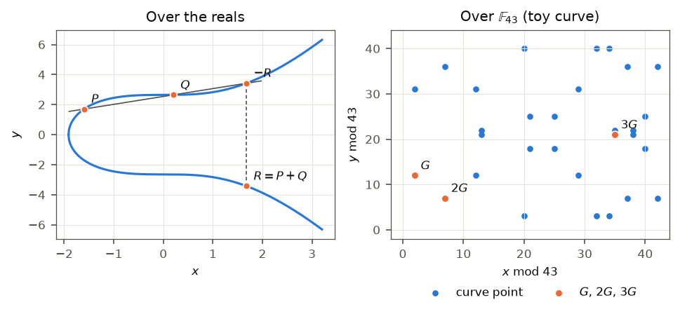

# Module 1: Foundations

2026-10-08

Previous: [Chapter 0, Orientation](00-orientation.md) \| [All
chapters](../README.md) \| Next: [Chapter 2, MPC
Custody](02-mpc-custody.md)

> [!WARNING]
>
> ### EDUCATIONAL, NOT PRODUCTION
>
> The code in `custody_lab.foundations` uses variable-time arithmetic
> and is written to be read. Production systems use libsecp256k1
> (Bitcoin Core’s library) or a vendor HSM. Where a real library is used
> in this chapter (`cryptography` for ECDSA verification and Ed25519),
> it is named.

<a id="what-this-chapter-is-for"></a>

## What this chapter is for

[Chapter 0](00-orientation.md) treated a key pair and a signature as
sealed boxes with one useful property: the public key can be computed
from the private key, and not the other way round. That was enough to
follow the demo. It is not enough to understand why the demo is built
the way it is, for two reasons.

First, the failures that have lost real coins happen inside the box.
Wallets have leaked their private keys by reusing one secret number in
two signatures. Implementations have produced invalid signatures by
mixing up two different kinds of arithmetic that look alike. Bitcoin has
had to change its rules because one signature could be rewritten into a
second valid one. Each of these is invisible from outside the box and
obvious from inside it.

Second, the demo’s central trick, two machines producing one signature
without either holding the key, works only because of a specific
property of one signature formula. [Chapter 0](00-orientation.md) showed
it with ordinary numbers: the signature is the key multiplied by a
number plus another number, so pieces of the key give pieces of the
signature. Bitcoin has two signature schemes, ECDSA and Schnorr. Only
Schnorr has that property in a usable form, and that difference decides
the shape of [chapter 2](02-mpc-custody.md).

This chapter opens the box. It starts from arithmetic that fits on a
clock face and builds, one step at a time, everything a Bitcoin key and
signature are made of. Each step is first shown on a toy curve whose
numbers are small enough to check by hand, then run on Bitcoin’s real
curve with a real library checking the result. The demo depends on this
chapter in step 2, where three processes create a key pair, in step 7,
where they produce a signature, and in step 8, where Bitcoin Core checks
that signature.

By the end of this chapter the following should be clear:

- how arithmetic modulo a prime works, including division, and why every
  modulus in the manual is prime;
- what an elliptic curve is, why its points can be added, and why adding
  a point to itself many times is easy while counting how many times it
  was added is not;
- what a signature proves, why it needs a fresh secret number each time,
  and how two signatures sharing that number give away the private key;
- what a hash function does inside a signature scheme;
- how ECDSA and Schnorr signatures (Bitcoin’s BIP340) are computed and
  checked, and why Schnorr is the one that splits easily between several
  signers;
- how Shamir secret sharing works on a clock, why one share reveals
  nothing, and why sharing alone does not solve custody.

<a id="first-principles"></a>

## First principles

Every number in this section is computed again by the code cell that
follows it, and the chapter fails to build if any of them is wrong.

<a id="arithmetic-on-a-clock"></a>

### Arithmetic on a clock

**The problem.** A Bitcoin private key is a 256-bit number, about 78
decimal digits. Ordinary arithmetic on numbers that size has two defects
for cryptography. Results grow without limit: multiplying two 78-digit
numbers gives a 155-digit number, and repeating that a few hundred times
gives numbers too large to store. And division usually leaves a
fraction, which cannot be represented exactly. Cryptography needs a
number system in which every result has the same fixed size and every
division comes out exact.

**The idea.** A 12-hour clock already works this way. Four hours after
10 o’clock is 2 o’clock, not 14 o’clock: the clock keeps only the
remainder after dividing by 12. Arithmetic **modulo** $m$ does the same
with any number $m$, called the modulus: after every addition,
subtraction or multiplication, only the remainder after division by $m$
is kept. The result is always between $0$ and $m - 1$, so a 256-bit
modulus keeps every result at 256 bits, however much arithmetic is done.

The symbol $\equiv$ means “leaves the same remainder”. Modulo 7:

- $5 + 4 = 9$, and $9 = 7 + 2$, so $5 + 4 \equiv 2$;
- $3 \times 5 = 15$, and $15 = 2 \times 7 + 1$, so
  $3 \times 5 \equiv 1$;
- $2 - 5 = -3$, and adding 7 gives $4$, so $2 - 5 \equiv 4$. A negative
  result is brought back into range by adding the modulus.

**Division.** On a clock, dividing by $a$ means multiplying by the
number that undoes $a$. That number is the **inverse** of $a$, written
$a^{-1}$: the number with $a \times a^{-1} \equiv 1$. Above,
$3 \times 5 \equiv 1$ modulo 7, so the inverse of 3 is 5, and “divide by
3” means “multiply by 5”. For example, $6 / 3$ should be 2, and indeed
$6 \times 5 = 30 = 4 \times 7 + 2$, so $6 \times 5 \equiv 2$. Modulo 7,
every number from 1 to 6 has an inverse:

| $a$              | 1   | 2   | 3   | 4   | 5   | 6   |
|------------------|-----|-----|-----|-----|-----|-----|
| $a^{-1} \bmod 7$ | 1   | 4   | 5   | 2   | 3   | 6   |

**Why the modulus must be prime.** Modulo 8, the number 2 has no
inverse. Twice any whole number is even, and an even number divided by 8
leaves an even remainder, so $2 \times k$ can never leave remainder 1.
Division by 2 is therefore impossible modulo 8. This happens whenever
the modulus shares a factor with the number, and a prime modulus shares
a factor with nothing smaller than itself. Every modulus in this manual
is therefore prime. The numbers $0$ to $p - 1$ for a prime $p$, with
addition, subtraction, multiplication and division modulo $p$, are
called the **finite field** $\mathbb{F}_p$.

Python computes remainders with `%` and inverses with `pow(a, -1, m)`:

``` python
from custody_lab.foundations.ec import TOY, Point

assert (5 + 4) % 7 == 2 and (3 * 5) % 7 == 1 and (2 - 5) % 7 == 4
assert 6 * pow(3, -1, 7) % 7 == 2  # 6 / 3 = 2, computed as 6 x 3^-1
assert [pow(a, -1, 7) for a in range(1, 7)] == [1, 4, 5, 2, 3, 6]
assert all(2 * k % 8 != 1 for k in range(8))  # 2 has no inverse modulo 8
```

The cell prints nothing: each line is an assertion, and the chapter’s
build would stop at the first one that failed.

**Recap.** Clock arithmetic keeps numbers at a fixed size, and with a
prime modulus every non-zero number can be divided by. The rest of the
chapter does all its arithmetic this way.

<a id="why-clock-multiplication-is-not-enough"></a>

### Why clock multiplication is not enough

**The problem.** A key pair needs a calculation that is easy in one
direction and infeasible in the other. The obvious candidate is
multiplication on a clock: pick a public number $g$ and compute the
public key as $Q = d \times g \bmod p$. It fails at once, because clock
arithmetic has division. Anyone can compute $d = Q \times g^{-1}$.

Modulo 43, with $g = 2$ and private key $d = 7$, the public key is
$Q = 14$. The inverse of 2 is 22, because $2 \times 22 = 44 \equiv 1$.
So $d = 14 \times 22 = 308 = 7 \times 43 + 7 \equiv 7$: the private key,
recovered in one multiplication.

``` python
p, g, d = 43, 2, 7
public = d * g % p
recovered = public * pow(g, -1, p) % p
assert (public, recovered) == (14, 7)
print(f"public key {public}; private key recovered by one division: {recovered}")
```

    public key 14; private key recovered by one division: 7

**The idea.** What is needed is an operation that can be repeated
cheaply but whose repetition count cannot be read back off the result.
Points on an elliptic curve provide one. Their “addition” is a geometric
rule, not ordinary addition, and repeating it has no known division
shortcut.

<a id="points-that-can-be-added"></a>

### Points that can be added

**The idea.** An **elliptic curve**, in this manual, is the set of pairs
of numbers $(x, y)$ that satisfy the equation $y^2 = x^3 + 7$, with all
arithmetic done modulo a prime $p$. Each pair is a point. secp256k1,
Bitcoin’s curve, uses a 256-bit prime. The toy curve in this chapter
uses $p = 43$, and it has 30 points, drawn in the right panel of the
figure. For example, $(2, 12)$ is a point:
$12^2 = 144 = 3 \times 43 + 15$, so the left side is 15, and
$2^3 + 7 = 15$.

<div id="fig-curves">



Figure 1: Left: point addition on $y^2 = x^3 + 7$ over the real numbers.
The line through $P$ and $Q$ meets the curve a third time at $-R$;
reflecting gives $R = P + Q$. Right: the same equation over
$\mathbb{F}_{43}$ has 30 points plus the point at infinity. The group
law is the same algebra, with every division replaced by a modular
inverse.

</div>

The curve comes with a rule that takes two points and produces a third.
It is called **addition** and written $P + Q$, although it is not adding
coordinates. Over ordinary real numbers the rule can be drawn, as in the
left panel: draw the straight line through $P$ and $Q$; it meets the
curve at exactly one more point; reflect that point across the
horizontal axis; the reflection is $P + Q$. Over $\mathbb{F}_{43}$ there
is no picture, because the points are scattered as in the right panel.
The same rule still applies as formulas: the slope of the line is a
division, and on a clock a division is a multiplication by an inverse.
The formulas are in the formal treatment, and the worked example applies
them by hand.

The rule earns the name “addition” because it obeys the four rules that
ordinary addition obeys:

- the order does not matter: $P + Q = Q + P$, because the line through
  $P$ and $Q$ is the same line;
- grouping does not matter: $(P + Q) + R = P + (Q + R)$;
- there is a zero, written $\mathcal{O}$, with $P + \mathcal{O} = P$;
- every point has a negative, its reflection $-P = (x, -y)$, and
  $P + (-P) = \mathcal{O}$.

The zero is an extra element, not a pair of numbers, called the **point
at infinity**. It is what adding a point to its own reflection gives:
the line through $P$ and $-P$ is vertical and meets the curve nowhere
else, so the rule needs an answer that is not on the curve. A set with
an operation that obeys these four rules is called a **group**. It is
the only abstract structure this manual needs, and it matters because
the four rules make expressions such as $3P$ or $P + Q + R$ mean the
same thing however they are calculated.

The cell checks all four rules on every point of the toy curve: 31
elements, counting $\mathcal{O}$, which the code represents as `None`.

``` python
elements = [None, *TOY.points()]
assert all(TOY.add(P, Q) == TOY.add(Q, P) for P in elements for Q in elements)
assert all(
    TOY.add(TOY.add(P, Q), R) == TOY.add(P, TOY.add(Q, R))
    for P in elements for Q in elements for R in elements
)
assert all(TOY.add(P, None) == P and TOY.add(P, TOY.neg(P)) is None for P in elements)
print(f"group rules hold for all {len(elements)} elements")
```

    group rules hold for all 31 elements

The grouping rule is checked for every one of the $31^3 = 29{,}791$
combinations of three elements, which is why the printed line can say
“all”.

**Recap.** Curve points can be added by a fixed rule that behaves like
ordinary addition. The next step repeats that addition and finds the
one-way property.

<a id="the-cycle-generator-order-and-scalar"></a>

### The cycle: generator, order and scalar

**The idea.** Pick a fixed point, here $G = (2, 12)$, and keep adding
it: $G$, then $2G = G + G$, then $3G = 2G + G$, and so on. $kG$ means
$G$ added to itself $k$ times. The cell takes this walk on the toy curve
by repeated addition and prints where each step lands:

``` python
walk, P = [], TOY.G
for _ in range(33):
    walk.append(P)  # walk[k - 1] is kG
    P = TOY.add(P, TOY.G)
assert len(set(walk[:30])) == 30 and walk[30] is None  # 30 distinct points, then 31G = O
assert walk[31] == TOY.G and walk[32] == walk[1]  # 32G = G and 33G = 2G: the cycle repeats
assert all(walk[k - 1] == TOY.mul(k, TOY.G) for k in range(1, 31))
for row in range(0, 30, 6):
    print("  ".join(f"{k:>2}G ({p.x:>2},{p.y:>2})"
                    for k, p in enumerate(walk[row:row + 6], start=row + 1)))
```

     1G ( 2,12)   2G ( 7, 7)   3G (35,21)   4G (21,18)   5G (12,12)   6G (29,31)
     7G (25,18)   8G (32,40)   9G (20,40)  10G (42, 7)  11G (40,25)  12G (37,36)
    13G (13,21)  14G (34,40)  15G (38,21)  16G (38,22)  17G (34, 3)  18G (13,22)
    19G (37, 7)  20G (40,18)  21G (42,36)  22G (20, 3)  23G (32, 3)  24G (25,25)
    25G (29,12)  26G (12,31)  27G (21,25)  28G (35,22)  29G ( 7,36)  30G ( 2,31)

Each entry reads “step number, then the point”: `7G (25,18)` means that
seven additions of $G$ land on the point $(25, 18)$. The walk visits all
30 points in a scrambled order, lands on $\mathcal{O}$ at step 31, and
then starts again: $32G = G$. Three terms name what the walk shows:

- $G$ is the **generator**: the published starting point from which
  every key is measured.
- The length of the cycle, $n = 31$, is the **order** of the group.
- A whole number $k$ that says how many times $G$ is added is a
  **scalar**.

**Two moduli.** Because the walk repeats every 31 steps, $33G$ is the
same point as $2G$: a step count matters only modulo 31. The manual
therefore uses two different moduli for two different kinds of number:

- the coordinates of a point are computed modulo $p = 43$, because that
  is the field the curve is defined over;
- scalars, meaning private keys, nonces and shares, which are step
  counts, are computed modulo $n = 31$, the length of the cycle.

Mixing the two up is a classic implementation bug, because both are just
large numbers and nothing in the code’s types tells them apart. The
ECDSA worked example below shows both in one signature: a point whose
$x$-coordinate is 42 produces a signature value of 11, because 42 is
reduced modulo 31 once it becomes a scalar.

**Positions add.** $aG + bG = (a + b)G$: adding $a$ copies of $G$ to $b$
copies of $G$ gives $a + b$ copies. Every signature check in this manual
is an application of that one fact, so it is worth checking on the walk:
$2G = (7, 7)$ and $5G = (12, 12)$ should add to $7G = (25, 18)$, and the
next cell confirms it.

**The mirror.** The second half of the cycle reflects the first.
$30G = (2, 31)$ is the reflection of $G = (2, 12)$, since
$43 - 12 = 31$, and in general $(n - k)G = -(kG)$: going $k$ steps
backwards from $\mathcal{O}$ lands on the reflection of going $k$ steps
forwards. A point and its reflection share an $x$-coordinate. Two rules
later in this chapter exist because of this mirror: BIP340 stores only
the $x$-coordinate of a public key (“Schnorr and BIP340” in the formal
treatment), and Bitcoin accepts only one of the two forms every ECDSA
signature has (“ECDSA”).

``` python
assert TOY.mul(2, TOY.G) == Point(7, 7) and TOY.mul(5, TOY.G) == Point(12, 12)
assert TOY.add(TOY.mul(2, TOY.G), TOY.mul(5, TOY.G)) == TOY.mul(7, TOY.G) == Point(25, 18)
assert TOY.mul(30, TOY.G) == TOY.neg(TOY.G) == Point(2, 31)
assert all(TOY.mul(31 - k, TOY.G).x == TOY.mul(k, TOY.G).x for k in range(1, 31))
```

**Recap.** Repeatedly adding a generator walks a cycle of length $n$.
Points are counted modulo $p$; steps are counted modulo $n$. Steps add,
and the second half of the cycle mirrors the first.

<a id="easy-forwards-infeasible-backwards"></a>

### Easy forwards, infeasible backwards

**The idea.** A **private key** is a secret step count $d$. The matching
**public key** is the point reached after $d$ steps: $Q = dG$. On the
toy curve, $d = 7$ gives $Q = (25, 18)$, which can be read off the walk
above.

**Forwards is fast.** A real private key is about $2^{256}$, so walking
one step at a time is out of the question. Doubling skips ahead:
$2G = G + G$, $4G = 2G + 2G$, $8G = 4G + 4G$, each costing one addition.
Any whole number is a sum of powers of two, so any $dG$ is a sum of
these doublings. $13 = 8 + 4 + 1$, so $13G = 8G + 4G + G$: three
doublings and two more additions instead of twelve. A 256-bit key needs
about 256 doublings and at most 256 further additions, a few hundred
operations in all. This method is **double-and-add**, `Curve.mul` in the
code.

**Backwards is infeasible.** Recovering $d$ from $Q$ is the **discrete
logarithm problem**. The doubling shortcut does not run in reverse, and
the walk visits points in an order with no known pattern, so nothing
about $Q$ says how far along the cycle it sits. On the toy curve, trying
every step count finds $d = 7$ on the seventh try. On secp256k1, $n$ is
about $2^{256}$, and the best known methods for ordinary computers, such
as Pollard’s rho algorithm, need about $\sqrt{n} \approx 2^{128}$ steps,
a 39-digit number. Clock multiplication failed this test with one
division; the curve has no division shortcut, which is why it is used.

Every scheme in chapters 1 to [5](05-settlement.md) depends on this
problem staying hard. A large enough quantum computer running Shor’s
algorithm would solve it. No such machine exists at the required scale
(**verify current**). [Chapter 7](07-post-quantum.md) covers the
response.

``` python
G = TOY.G
assert TOY.add(TOY.add(TOY.mul(8, G), TOY.mul(4, G)), G) == TOY.mul(13, G)
Q = TOY.mul(7, G)
tries = next(k for k in range(1, TOY.n) if TOY.mul(k, G) == Q)
assert Q == Point(25, 18) and tries == 7
print(f"Q = ({Q.x}, {Q.y}); brute force found d = {tries}")
```

    Q = (25, 18); brute force found d = 7

The printed line shows the public key and the result of the only attack
available on the toy curve, trying every step count. It succeeds here
because there are 31 to try.

**Recap.** A public key is the point reached after $d$ steps. Computing
it takes a few hundred operations; recovering $d$ from it takes about
$2^{128}$.

<a id="what-a-signature-proves"></a>

### What a signature proves

**The problem.** A signature has to convince anyone who holds the public
key $Q$ that whoever holds $d$ approved one particular message, and it
must do so without revealing $d$. It is not obvious that a number can do
both.

**The idea, first as a conversation.** The mechanism is easiest to see
as a live exchange between a **prover**, who holds $d$, and a
**verifier**, who holds only $Q$. This is Schnorr’s identification
protocol (1989). It works like a challenge-response login with a
hardware token or an SSH key: the server sends a random challenge, and
only the key holder can answer it. Unlike a password, nothing the
verifier sees during the exchange would let the verifier answer a
challenge itself later.

The exchange has four steps:

1.  **Commit.** The prover picks a fresh random secret number $k$ and
    sends the point $R = kG$.
2.  **Challenge.** The verifier picks a random number $e$ and sends it.
3.  **Respond.** The prover sends $s = k + e\,d \bmod n$.
4.  **Check.** The verifier accepts if and only if $sG = R + eQ$.

| Step | Prover (knows $d$) | Verifier (knows $Q = dG$) |
|----|----|----|
| 1\. Commit | picks a random secret $k$; sends $R = kG$ |  |
| 2\. Challenge |  | picks a random $e$; sends it |
| 3\. Respond | sends $s = k + e\,d \bmod n$ |  |
| 4\. Check |  | accepts if and only if $sG = R + eQ$ |

**An honest prover passes.** Because positions add, $sG$ is $G$ added
$k + ed$ times, which is $k$ times plus $e$ lots of $d$ times:
$sG = (k + ed)G = kG + e(dG) = R + eQ$. The verifier can compute both
sides, since it knows $s$, $R$, $e$ and $Q$, and it never needs $d$.

**The nonce hides the key.** The response $s = k + ed$ contains $d$, but
added to $k$, which is random, secret and used once. Whatever the values
of $d$ and $e$, a uniformly random $k$ makes $s$ uniformly random, so
$s$ carries no information about $d$. A one-time pad hides a message the
same way: adding a random number known only to the sender turns any
message into noise. $k$ is the **nonce**, short for “number used once”,
and it is the only thing standing between $s$ and the key.

**The prover must commit first.** If the prover knew $e$ before choosing
$R$, it could pass without knowing $d$. It would pick any $s$ it likes
and then set $R = sG - eQ$; the check $sG = R + eQ$ then holds by
construction. Sending $R$ before $e$ exists rules this out. A
**commitment** is a value published now that fixes a choice before the
information that could bias it arrives. Commitments recur throughout
[chapter 2](02-mpc-custody.md).

**Reusing the nonce reveals the key.** Two runs with the same $k$ and
different challenges give $s_1 = k + e_1 d$ and $s_2 = k + e_2 d$. That
is two equations with two unknowns, $k$ and $d$. Subtracting the second
from the first removes $k$: $s_1 - s_2 = (e_1 - e_2)\,d$, so
$d = (s_1 - s_2)/(e_1 - e_2)$, a division that is always possible on a
clock.

Exchange APIs also use the word nonce, for a different thing. There, a
nonce is a public number that must increase with every signed request,
and a repeated value is detected and rejected, like a repeated FIX
sequence number. A repeated signature nonce is not detected by anything,
because each signature is valid on its own. The damage appears only when
someone puts the two signatures side by side.

**Worked by hand on the toy curve**, with $d = 7$, $Q = (25, 18)$ and
nonce $k = 10$. All scalar arithmetic is modulo $n = 31$.

| Step | Computation | Value |
|----|----|----|
| Commitment | $R = 10G$, read off the walk | $(42, 7)$ |
| Response to $e_1 = 5$ | $s_1 = 10 + 5 \times 7 = 45 = 31 + 14$ | $14$ |
| Check | $14G$ against $R + 5Q = 10G + 35G = 45G = 14G$ | holds |
| Same nonce, $e_2 = 12$ | $s_2 = 10 + 12 \times 7 = 94 = 3 \times 31 + 1$ | $1$ |
| Key from the two runs | $(14 - 1) \times (5 - 12)^{-1} = 13 \times 22 = 286 = 9 \times 31 + 7$ | $d = 7$ |
| Forgery when $e = 4$ is known first | choose $s = 1$; $R = G - 4Q = (1 - 28)G = -27G \equiv 4G$ | $R = (21, 18)$ |

Two steps need a closer look. $(5 - 12)^{-1}$ is the inverse of
$-7 \equiv 24$, which is 22, because
$24 \times 22 = 528 = 17 \times 31 + 1$. And in the forgery,
$-27 \equiv 4$ modulo 31, so the forger sends $R = 4G = (21, 18)$ and
$s = 1$. The verifier computes $R + 4Q = 4G + 28G = 32G \equiv 1G = sG$,
and the check passes although $d$ was never used.

``` python
n, k = TOY.n, 10
R = TOY.mul(k, G)
s1 = (k + 5 * 7) % n
assert s1 == 14 and TOY.mul(s1, G) == TOY.add(R, TOY.mul(5, Q))
s2 = (k + 12 * 7) % n
assert s2 == 1 and (s1 - s2) * pow(5 - 12, -1, n) % n == 7  # the key, from two runs
R_forged = TOY.add(G, TOY.neg(TOY.mul(4, Q)))  # s = 1, with e = 4 known in advance
assert R_forged == Point(21, 18) and G == TOY.add(R_forged, TOY.mul(4, Q))
```

**Recap.** A Schnorr response is the nonce plus the challenge times the
key. The nonce hides the key only if it is secret and never reused, and
the commitment must be fixed before the challenge is known. What remains
is to remove the live verifier, which needs a hash function.

<a id="fingerprints-hash-functions"></a>

### Fingerprints: hash functions

**The problem.** A signature cannot wait for a live verifier to send a
challenge: it is checked later, by anyone, any number of times.
Something has to produce the challenge in a way the prover cannot steer.
A hash function does it.

**The idea.** A **hash function** turns an input of any length into an
output of fixed length, called a digest. SHA-256, the function Bitcoin
uses, produces 32 bytes. [Chapter 0](00-orientation.md) described its
behaviour as a fingerprint. For cryptography, the fingerprint must
resist three attacks, each of which would break something specific:

- **Preimage:** given a digest, find any input that produces it. If this
  were easy, a digest would reveal what it was computed from.
- **Second preimage:** given an input, find a different input with the
  same digest. If this were easy, a signature over one message’s digest
  would also cover a different message.
- **Collision:** find any two inputs with the same digest. If this were
  easy, an attacker could prepare two messages, get the harmless one
  signed, and use the signature on the other.

For SHA-256 no method faster than guessing is known for any of the
three, and guessing would take about $2^{256}$ tries for a preimage and
$2^{128}$ for a collision.

``` python
from custody_lab.foundations.hashing import sha256

for text in [b"deliver 0.85 BTC", b"deliver 8.50 BTC"]:
    print(f"{text.decode()}  ->  {sha256(text).hex()[:32]}...")
```

    deliver 0.85 BTC  ->  a2203c2eb279e988eb78cb88921df9a0...
    deliver 8.50 BTC  ->  7095ee07a66ff4820aa131718b09b891...

The two inputs differ in one character, and their digests (the first 32
of 64 hexadecimal characters are printed) share no pattern.

<a id="from-a-conversation-to-a-signature"></a>

### From a conversation to a signature

**The idea.** The **Fiat-Shamir transform** removes the live verifier by
computing the challenge as a hash of the commitment, the public key and
the message: $e = H(R \,\|\, Q \,\|\, m)$, where $\|$ means “followed
by”. The prover still cannot choose $R$ after $e$, because $e$ is
computed from $R$: changing $R$ changes $e$ unpredictably, so there is
no way to search for an $R$ that produces a convenient $e$. Putting $m$
into the hash ties the proof to that message. The pair $(R, s)$ is a
**Schnorr signature**.

**Worked by hand on the toy curve.** Same key $d = 7$, $Q = (25, 18)$
and nonce $k = 10$, $R = (42, 7)$. The message is “deliver 0.85 BTC”.
The toy challenge is SHA-256 of the text `42,7,25,18,deliver 0.85 BTC`,
read as a number and reduced modulo 31, which gives $e = 18$.

| Step | Computation | Value |
|----|----|----|
| Challenge | $e = H(R \,\|\, Q \,\|\, m) \bmod 31$ | $18$ |
| Response | $s = 10 + 18 \times 7 = 136 = 4 \times 31 + 12$ | $12$ |
| Signature | $(R, s)$ | $((42, 7), 12)$ |
| Check, left side | $12G$, read off the walk | $(37, 36)$ |
| Check, right side | $R + eQ = 10G + 126G = 136G = 12G$ | $(37, 36)$: valid |
| Altered message | “deliver 8.50 BTC” gives $e = 20$; $R + 20Q = 10G + 140G = 26G$ | $(12, 31)$: invalid |

The altered message changes the challenge, the right side lands on a
different point, and the signature fails. That is the property [chapter
0](00-orientation.md) demonstrated with a library, now visible in the
arithmetic.

``` python
import hashlib


def toy_challenge(R, Q, message):
    data = f"{R.x},{R.y},{Q.x},{Q.y},".encode() + message
    return int(hashlib.sha256(data).hexdigest(), 16) % TOY.n


e = toy_challenge(R, Q, b"deliver 0.85 BTC")
s = (k + e * 7) % TOY.n
assert (e, s) == (18, 12)
assert TOY.mul(s, G) == TOY.add(R, TOY.mul(e, Q)) == Point(37, 36)
e_altered = toy_challenge(R, Q, b"deliver 8.50 BTC")
assert e_altered == 20 and TOY.add(R, TOY.mul(e_altered, Q)) == Point(12, 31)
print(f"e = {e}, s = {s}; altered message: e = {e_altered}, signature rejected")
```

    e = 18, s = 12; altered message: e = 20, signature rejected

ECDSA, the older of Bitcoin’s two schemes, uses the same ingredients (a
nonce, a commitment $R = kG$ and a hash) in a different equation, given
in the formal treatment. A reused ECDSA nonce gives away the key in the
same way (Exercise 3).

**Recap.** Hashing the commitment and message produces a challenge
nobody can steer, which turns the conversation into a signature anyone
can check later.

<a id="sharing-a-secret-as-a-line-through-points"></a>

### Sharing a secret as a line through points

**The problem.** [Chapter 0](00-orientation.md) split a key as points on
a straight line over ordinary numbers, and noted that one share then
reveals a little about the secret. Real secret sharing uses clock
arithmetic, and on a clock one share reveals nothing at all.

**The idea.** Shamir’s scheme (1979) rests on the fact that two points
fix a straight line and one point does not. To share a secret $s$ so
that any two of three parties can recover it:

1.  Choose a line that crosses the vertical axis at $s$, with a slope
    $c_1$ picked at random: $f(x) = s + c_1 x$, computed modulo a prime.
2.  Give party $i$ the point $(i, f(i))$ for $i = 1, 2, 3$. That point
    is its **share**.
3.  Any two shares fix the line, and the line’s value at $x = 0$ is the
    secret.

**Why one share reveals nothing.** Take the worked example below, which
shares $s = 9$ modulo 31 and gives party 1 the share $(1, 14)$. For each
of the 31 possible secrets there is exactly one slope that makes a line
through $(1, 14)$ start at that secret: the slope is $14 - s$. The slope
was drawn uniformly from all 31 values, so each of the 31 secrets is
exactly as likely as any other, given the share. Over ordinary numbers
there is no uniform choice of slope from infinitely many, which is why
[chapter 0](00-orientation.md)’s version leaked a little. For a
threshold of $t$, the line becomes a curve of degree $t - 1$ (a parabola
for $t = 3$), and $t$ points fix it while $t - 1$ do not.

``` python
from custody_lab.foundations import shamir

lines = [
    shamir.split(s, threshold=2, count=3, modulus=31, coefficients=[(14 - s) % 31])
    for s in range(31)
]
assert all(line[0] == shamir.Share(1, 14) for line in lines)
print("share (1, 14) is consistent with all 31 secrets, one line each")
```

    share (1, 14) is consistent with all 31 secrets, one line each

The cell builds 31 lines, one for each possible secret, and checks that
every one of them gives party 1 the same share.

**Recovering the secret from weights.** The secret is a weighted sum of
the shares, and the weights depend only on which parties take part.
[Chapter 0](00-orientation.md) found weights $1.5$ and $-0.5$ for
holders 1 and 3. On a clock the same fractions become whole numbers:
$1.5 = 3/2 = 3 \times 2^{-1}$, and the inverse of 2 modulo 31 is 16,
because $2 \times 16 = 32 \equiv 1$. So the weight for holder 1 is
$3 \times 16 = 48 \equiv 17$, and the weight for holder 3 is
$-1/2 = -16 \equiv 15$. These weights are the **Lagrange coefficients**,
written $\lambda_i$; the formal treatment gives the general formula.

The weights matter for custody because each party can multiply its own
share by its own weight without seeing anyone else’s share. [Chapter
2](02-mpc-custody.md) builds threshold signing on exactly that.

``` python
assert pow(2, -1, 31) == 16
assert shamir.lagrange_coefficient(1, [1, 3], 31) == 3 * 16 % 31 == 17
assert shamir.lagrange_coefficient(3, [1, 3], 31) == -16 % 31 == 15
```

**What sharing alone does not solve.** To sign with a Shamir-shared key,
the shares must be combined into the key somewhere, and that place holds
the whole key for as long as signing takes. Sharing protects a key at
rest and leaves it exposed in use. [Chapter 2](02-mpc-custody.md)
removes the rebuild.

**Recap.** On a clock, a share is a point on a random line, one share is
consistent with every secret equally, and the secret is a weighted sum
of any $t$ shares with weights that depend only on who takes part.

<a id="formal-treatment"></a>

## Formal treatment

The first-principles section built each idea by example. This section
states each one in general form, with every symbol named.

<a id="fields-and-curves"></a>

### Fields and curves

$\mathbb{F}_p$ is the numbers $0$ to $p - 1$ for a prime $p$, with
addition and multiplication modulo $p$. Every non-zero element has an
inverse, computed in Python as `pow(a, -1, p)`. An elliptic curve over
$\mathbb{F}_p$ is the set of solutions $(x, y)$ of $y^2 = x^3 + ax + b$,
together with the point at infinity $\mathcal{O}$, which acts as zero.
For two different points $P$ and $Q$, the sum $R = P + Q$ is

$$
\lambda = \frac{y_Q - y_P}{x_Q - x_P}, \qquad
x_R = \lambda^2 - x_P - x_Q, \qquad
y_R = \lambda (x_P - x_R) - y_P .
$$

$\lambda$ is the slope of the line through $P$ and $Q$: rise over run,
as in the picture, with the division done as multiplication by an
inverse. The second formula finds where the line meets the curve a third
time, and the third formula gives the reflected $y$. When $P = Q$ there
is no “line through two points”, and the line is the tangent at $P$,
whose slope is $\lambda = (3x_P^2 + a) / (2y_P)$. For Bitcoin’s curve
$a = 0$ and $b = 7$.

The points form a group of order $n$, and $n \cdot G = \mathcal{O}$.
Coordinates are reduced modulo $p$; scalars (keys $d$, nonces $k$,
shares) are reduced modulo $n$.

secp256k1 is $y^2 = x^3 + 7$ with $p = 2^{256} - 2^{32} - 977$ and a
prime $n$ slightly below $p$. The toy curve in this chapter is the same
equation over $\mathbb{F}_{43}$, with $n = 31$.

<a id="hash-functions"></a>

### Hash functions

A cryptographic hash $H$ maps any input to a fixed-size digest and
resists preimage, second-preimage and collision attacks, as described in
“Fingerprints: hash functions”. Inside a signature scheme the hash does
three separate jobs:

1.  **Digest.** The signer signs $z = H(m)$ rather than $m$ itself, so a
    signature has a fixed size whatever the message length. It is also
    why a signer, including a threshold signer, can sign a digest it did
    not compute: in the demo, the signers sign the transaction’s
    sighash.
2.  **Challenge.** In Schnorr, $e = H(R \,\|\, P \,\|\, m)$ replaces the
    verifier’s random challenge (the Fiat-Shamir transform).
3.  **Nonce derivation.** BIP340, EdDSA and RFC 6979 derive $k$ from a
    hash of the private key and the message, so that a broken
    random-number generator cannot cause nonce reuse.

BIP340 **tags** each hash with its purpose:
$H_{\text{tag}}(x) = \text{SHA256}(\text{SHA256}(\text{tag}) \,\|\, \text{SHA256}(\text{tag}) \,\|\, x)$.
The tag is a short string such as `BIP0340/challenge` or
`BIP0340/nonce`. Without tags, the same input fed to the nonce hash and
to the challenge hash would give the same digest, and a value computed
for one purpose could be passed off as the other. Tagging makes the two
functions unrelated. Keeping hashes for different purposes apart this
way is called domain separation.

<a id="ecdsa"></a>

### ECDSA

ECDSA is the signature scheme Bitcoin used from 2009 and still accepts.
Key: a private key $d$ between 1 and $n - 1$, and the public key
$Q = dG$. To sign a message digest $z$:

$$
k \xleftarrow{\$} [1, n-1], \quad R = kG, \quad r = x_R \bmod n, \quad s = k^{-1}(z + r d) \bmod n .
$$

In words: pick a random nonce $k$; compute the point $R = kG$; keep only
its $x$-coordinate, reduced modulo $n$, as $r$; and compute $s$ by
adding the digest to $r$ times the key and dividing by the nonce. The
signature is the pair $(r, s)$.

To verify $(r, s)$ against $Q$: compute $u_1 = z s^{-1}$ and
$u_2 = r s^{-1}$, then the point $X = u_1 G + u_2 Q$, and accept if and
only if $x_X \bmod n = r$. This works because positions add:
$X = s^{-1} z G + s^{-1} r d G = s^{-1}(z + rd)\,G$, and
$s^{-1}(z + rd) = k$ by the signing formula, so $X = kG = R$.

**Two valid forms, and the low-S rule.** Both $(r, s)$ and $(r, n - s)$
verify. Replacing $s$ by $n - s$ is the same as replacing $k$ by $-k$,
which replaces $R$ by its mirror image $-R$, and $R$ and $-R$ have the
same $x$-coordinate, so $r$ is unchanged. Anyone can therefore turn one
valid signature into a second valid one without the key. In Bitcoin that
once let third parties change a transaction’s identifier while it was
waiting to be mined. Bitcoin Core now relays only the **low-S** form, in
which $s$ is at most $n/2$ (BIP 146), so a signer replaces $s$ by
$n - s$ when $s > n/2$.

<a id="schnorr-and-bip340"></a>

### Schnorr and BIP340

Key: $d$, $P = dG$. To sign the message $m$:

$$
R = kG, \quad e = H(R \,\|\, P \,\|\, m) \bmod n, \quad s = k + e\,d \bmod n .
$$

To verify $(R, s)$: accept if and only if $sG = R + eP$. This is the
identification protocol of the first-principles section with the
challenge computed by a hash.

**Linearity.** The Schnorr equation only adds secrets and multiplies
them by public numbers. If two parties hold $d = d_1 + d_2$ and
$k = k_1 + k_2$, then each can compute $s_i = k_i + e\,d_i$ alone, and
$s = s_1 + s_2$. ECDSA’s $s = k^{-1}(z + rd)$ multiplies one secret by
the inverse of another ($k^{-1}$ times $d$). Splitting that product
between parties who must not learn each other’s pieces needs much
heavier tools, such as Paillier encryption or oblivious transfer. That
is why [chapter 2](02-mpc-custody.md) has a two-party ECDSA protocol and
a separate, simpler protocol, FROST, for Schnorr.

BIP340 is Bitcoin’s version of Schnorr, used by Taproot outputs. It adds
three rules:

- **x-only keys.** Public keys and $R$ are stored as their
  $x$-coordinate only, 32 bytes. Because of the mirror, each $x$ belongs
  to two points, $P$ and $-P$, and BIP340 always means the one whose
  $y$-coordinate is even. A signer whose key point has an odd $y$ uses
  $-d$ in place of $d$, since $(-d)G = -P$ is the mirrored point with
  even $y$. The same is done for $k$ and $R$.
- **Tagged hashes** for the challenge and the nonce.
- **Nonce derivation.** $k$ is derived from $d$, the message and 32
  bytes of extra randomness, so that a weak random-number generator
  alone cannot cause a repeated nonce.

<a id="eddsa"></a>

### EdDSA

EdDSA (RFC 8032), and its common instance Ed25519 on Curve25519, is
Schnorr on a different curve shape (a twisted Edwards curve) with one
change that matters for custody: the nonce is *deterministic*,
$k = H(\text{prefix} \,\|\, m)$, where the prefix is derived from the
private key. There is no randomness at all, so a single signer can never
repeat a nonce for different messages. The demo’s approvals are Ed25519
signatures. A threshold group cannot use this rule, because no single
party knows the prefix, and computing the hash jointly would need a
costly MPC protocol; threshold EdDSA therefore uses random nonces. A
verifier cannot tell the difference.

<a id="shamir-secret-sharing"></a>

### Shamir secret sharing

To share a secret $s$ with threshold $t$ among $n$ parties, working
modulo a prime $q$: pick random $c_1, \dots, c_{t-1}$, form the
polynomial $f(x) = s + c_1 x + \dots + c_{t-1}x^{t-1}$, and give party
$i$ the share $(i, f(i))$. Any $t$ shares determine $f$, and for any set
$S$ of $t$ parties

$$
s = f(0) = \sum_{i \in S} \lambda_i f(i), \qquad
\lambda_i = \prod_{j \in S,\, j \ne i} \frac{0 - j}{i - j} \bmod q .
$$

$\lambda_i$ is the product, over every other party $j$ in the set, of
$(0 - j)/(i - j)$. For parties 1 and 3 it gives
$\lambda_1 = (0 - 3)/(1 - 3) = 3/2$ and
$\lambda_3 = (0 - 1)/(3 - 1) = -1/2$, the weights found earlier. With
$t - 1$ shares, every candidate secret is consistent with exactly one
polynomial, so the shares carry no information about $s$ (Shamir 1979).

<a id="worked-example"></a>

## Worked example

<a id="doubling-on-the-toy-curve"></a>

### Doubling on the toy curve

Compute $2G$ from $G = (2, 12)$ on $y^2 = x^3 + 7$ over
$\mathbb{F}_{43}$, with the doubling formulas. First check that $G$ is
on the curve: $12^2 = 144 \equiv 15$ and $2^3 + 7 = 15$.

| Step | Computation | Value |
|----|----|----|
| Tangent slope | $\lambda = 3 \cdot 2^2 / (2 \cdot 12) = 12 \cdot 24^{-1}$; $24^{-1} \equiv 9$ since $24 \cdot 9 = 216 = 5 \cdot 43 + 1$ | $\lambda = 108 \equiv 22$ |
| $x_{2G}$ | $22^2 - 2 - 2 = 480$ | $480 \equiv 7$ |
| $y_{2G}$ | $22\,(2 - 7) - 12 = -122$ | $-122 \equiv 7$ |

$108 = 2 \times 43 + 22$, $480 = 11 \times 43 + 7$, and
$-122 + 3 \times 43 = 7$. So $2G = (7, 7)$, the second entry of the
walk. The code agrees, and the chapter fails to build if it does not:

``` python
from custody_lab.foundations.ec import TOY, Point

assert TOY.mul(2, TOY.G) == Point(7, 7)
print(f"{len(TOY.points())} affine points + infinity = {TOY.n} = n")
```

    30 affine points + infinity = 31 = n

The printed line confirms the count used throughout: 30 points with
coordinates, plus $\mathcal{O}$, is the order 31.

<a id="ecdsa-on-the-toy-curve"></a>

### ECDSA on the toy curve

Private key $d = 7$, message digest $z = 17$, nonce $k = 10$. Scalars
are modulo $n = 31$.

| Step | Computation | Value |
|----|----|----|
| Public key | $Q = 7G$ | $(25, 18)$ |
| Nonce point | $R = 10G$ | $(42, 7)$ |
| $r$ | $x_R \bmod n = 42 \bmod 31$ | $11$ |
| $k^{-1}$ | $10 \cdot 28 = 280 = 9 \cdot 31 + 1$ | $28$ |
| $s$ | $28\,(17 + 11 \cdot 7) = 28 \cdot 94$; $94 \equiv 1$ | $28$ |
| Low-S | $28 > 31/2$, so $s \leftarrow 31 - 28$ | $3$ |
| Signature |  | $(r, s) = (11, 3)$ |
| Verify: $w = s^{-1}$ | $3 \cdot 21 = 63 = 2 \cdot 31 + 1$ | $21$ |
| $u_1, u_2$ | $17 \cdot 21 \bmod 31$, $11 \cdot 21 \bmod 31$ | $16, 14$ |
| $X$ | $16G + 14Q = 16G + 98G = 114G \equiv 21G$ | $(42, 36)$ |
| Check | $42 \bmod 31 = 11 = r$ | valid |

Two details in the table come straight from the first-principles
section. The verifier’s point $X = (42, 36)$ is $-R$, not $R$: the low-S
flip replaced $k$ by $-k$, and $-R$ has the same $x$, so the check still
passes. And $x_R = 42$ becomes $r = 11$: the coordinate is a number
modulo $p = 43$, and the signature value is a number modulo $n = 31$.

``` python
from custody_lab.foundations import ecdsa

Q = TOY.mul(7, TOY.G)
sig = ecdsa.sign(7, 17, curve=TOY, k=10)
assert (Q, sig) == (Point(25, 18), ecdsa.Signature(r=11, s=3))
assert ecdsa.verify(Q, 17, sig, curve=TOY)
print(Q, sig)
```

    Point(x=25, y=18) Signature(r=11, s=3)

<a id="shamir-2-of-3-over-mathbbz_31"></a>

### Shamir 2-of-3 over $\mathbb{Z}_{31}$

Secret $s = 9$ and slope $c_1 = 5$, so $f(x) = 9 + 5x$ modulo 31, and
the shares are $(1, 14)$, $(2, 19)$ and $(3, 24)$. From shares 1 and 3,
the weights found in “Sharing a secret as a line through points” are
$\lambda_1 = 17$ and $\lambda_3 = 15$. Then
$14 \times 17 + 24 \times 15 = 238 + 360 = 598 = 19 \times 31 + 9$, so
$s = 9$.

``` python
from custody_lab.foundations import shamir

shares = shamir.split(9, threshold=2, count=3, modulus=31, coefficients=[5])
assert [(sh.x, sh.y) for sh in shares] == [(1, 14), (2, 19), (3, 24)]
assert shamir.lagrange_coefficient(1, [1, 3], 31) == 17
assert shamir.reconstruct([shares[0], shares[2]], modulus=31) == 9
```

<a id="code-walkthrough"></a>

## Code walkthrough

The toy curve showed each formula by hand. This section runs the same
code on secp256k1 and checks it against independent implementations.

<a id="ecdsa-on-secp256k1-checked-by-an-independent-library"></a>

### ECDSA on secp256k1, checked by an independent library

The educational signer produces a signature, and `cryptography`, which
uses OpenSSL underneath, verifies it. The verifier sees only the public
key, the digest and the signature, and cannot tell how the signature was
made. The same will hold in [chapter 2](02-mpc-custody.md), where the
signature comes from several machines.

``` python
from cryptography.hazmat.primitives import hashes
from cryptography.hazmat.primitives.asymmetric import ec
from cryptography.hazmat.primitives.asymmetric.utils import (
    Prehashed,
    encode_dss_signature,
)

from custody_lab.foundations.ec import SECP256K1
from custody_lab.foundations.hashing import sha256

d, Q = ecdsa.generate_keypair()
digest = sha256(b"SETTLE batch=42 asset=BTC qty=1.50000000 to=bcrt1p...")
sig = ecdsa.sign(d, ecdsa.hash_to_int(digest))
assert ecdsa.verify(Q, ecdsa.hash_to_int(digest), sig)

library_key = ec.EllipticCurvePublicNumbers(Q.x, Q.y, ec.SECP256K1()).public_key()
der = encode_dss_signature(sig.r, sig.s)
library_key.verify(der, digest, ec.ECDSA(Prehashed(hashes.SHA256())))  # raises if invalid
print("verified by cryptography; low-S:", sig.s <= SECP256K1.n // 2)
```

    verified by cryptography; low-S: True

The printed line reports that OpenSSL accepted the signature and that
the signer produced the low-S form Bitcoin requires.

<a id="bip340-against-the-official-test-vector"></a>

### BIP340 against the official test vector

BIP 340 publishes test vectors: inputs and the exact outputs a correct
implementation must produce. Vector 0 uses secret key 3, all-zero extra
randomness and an all-zero message. The cell checks the public key and
the 64-byte signature byte for byte. The full set of 19 vectors,
including ones that must be rejected, runs in
`tests/foundations/test_schnorr.py`.

``` python
from custody_lab.foundations import schnorr

seckey = (3).to_bytes(32, "big")
sig = schnorr.sign(bytes(32), seckey, aux_rand=bytes(32))
assert schnorr.pubkey_gen(seckey).hex().upper() == (
    "F9308A019258C31049344F85F89D5229B531C845836F99B08601F113BCE036F9")
assert sig.hex().upper() == (
    "E907831F80848D1069A5371B402410364BDF1C5F8307B0084C55F1CE2DCA8215"
    "25F66A4A85EA8B71E482A74F382D2CE5EBEEE8FDB2172F477DF4900D310536C0")
print(len(schnorr.pubkey_gen(seckey)), "byte key,", len(sig), "byte signature")
```

    32 byte key, 64 byte signature

The sizes printed are those of every Bitcoin Taproot key and signature:
a 32-byte x-only key and a 64-byte signature, $R$’s $x$-coordinate
followed by $s$.

<a id="shamir-on-a-real-private-key"></a>

### Shamir on a real private key

A secp256k1 private key split 2-of-3. Each of the three possible pairs
of shares rebuilds it, and the rebuilt key produces the same public key.
Rebuilding is the step [chapter 2](02-mpc-custody.md) eliminates.

``` python
from itertools import combinations

d, Q = ecdsa.generate_keypair()
shares = shamir.split(d, threshold=2, count=3)
for pair in combinations(shares, 2):
    assert SECP256K1.mul(shamir.reconstruct(pair), SECP256K1.G) == Q
print("all three 2-of-3 subsets rebuild the key")
```

    all three 2-of-3 subsets rebuild the key

<a id="ed25519-with-a-production-library"></a>

### Ed25519 with a production library

`cryptography`’s Ed25519 is the real-library counterpart for EdDSA.
Signing the same message twice gives the same signature, because the
nonce is a hash of the key and the message.

``` python
from cryptography.hazmat.primitives.asymmetric.ed25519 import Ed25519PrivateKey

key = Ed25519PrivateKey.generate()
msg = b"approve instruction 42"
sig1, sig2 = key.sign(msg), key.sign(msg)
key.public_key().verify(sig1, msg)
print(len(sig1), "byte signature; deterministic:", sig1 == sig2)
```

    64 byte signature; deterministic: True

<a id="linearity-a-naive-two-party-schnorr-signature"></a>

### Linearity: a naive two-party Schnorr signature

The Schnorr equation split between two parties who never share their key
pieces $d_i$ or nonce pieces $k_i$. Each contributes $k_i + e\,d_i$, and
the sum verifies under the sum of their public keys, although nobody
ever held $d = d_1 + d_2$.

It is *insecure as written*. A dishonest party could choose its public
key after seeing the other’s, so that the joint key is one it controls
alone (a rogue-key attack), or choose its nonce after seeing the
other’s, to steer $R$. The commitments and binding values that stop both
are what FROST adds in [chapter 2](02-mpc-custody.md). The cell uses
textbook Schnorr (full points, a plain SHA-256 challenge), not BIP340’s
x-only encoding.

``` python
import secrets

G, n = SECP256K1.G, SECP256K1.n
d1, d2 = 1 + secrets.randbelow(n - 1), 1 + secrets.randbelow(n - 1)
k1, k2 = 1 + secrets.randbelow(n - 1), 1 + secrets.randbelow(n - 1)
P = SECP256K1.add(SECP256K1.mul(d1, G), SECP256K1.mul(d2, G))  # joint public key
R = SECP256K1.add(SECP256K1.mul(k1, G), SECP256K1.mul(k2, G))  # joint nonce point
assert P is not None and R is not None
e = int.from_bytes(sha256(f"{R}{P}settle 42".encode()), "big") % n
s = (k1 + e * d1 + k2 + e * d2) % n  # each party contributes k_i + e*d_i
assert SECP256K1.mul(s, G) == SECP256K1.add(R, SECP256K1.mul(e, P))
print("s1 + s2 verifies under P1 + P2; nobody held d = d1 + d2")
```

    s1 + s2 verifies under P1 + P2; nobody held d = d1 + d2

<a id="how-this-shows-up-in-production"></a>

## How this shows up in production

**Constant-time libraries.** Bitcoin Core and most wallets use
libsecp256k1. The code in this chapter does not: `Curve.mul` takes a
different branch for each 1-bit and 0-bit of the key, so the time it
takes depends on the key. Anyone who can time many signatures precisely,
from another process on the same machine or sometimes over a network,
can recover key bits from the timings. Production code is
**constant-time**: it performs the same operations whatever the secret
values are. [Chapter 3](03-key-storage.md) covers this and other side
channels.

**Nonce failures are the classic ECDSA break.** Sony’s PlayStation 3
firmware signing used the same nonce for every signature, which let
outsiders compute Sony’s signing key (disclosed 2010). In 2013 a flaw in
Android’s `SecureRandom` random-number generator produced repeated
nonces in Bitcoin wallet apps, and coins were stolen using the
two-equation attack above. RFC 6979 deterministic nonces and BIP340’s
hashed nonces exist because of failures like these. Nonces need not
repeat exactly to be dangerous: if some bits of many nonces are
predictable, lattice methods can combine many signatures to recover the
key.

**Malleability.** Anyone can turn a valid ECDSA signature $(r, s)$ into
$(r, n - s)$, as the formal treatment showed. Bitcoin policy accepts
only the low-S form. SegWit (2017) also moved signatures out of the data
that a transaction’s identifier is computed from, so changing a
signature no longer changes the identifier.

**Taproot.** Bitcoin’s Taproot outputs (BIP 341) are locked to a BIP340
x-only key. The demo’s regtest settlements spend exactly such outputs,
with signatures produced by FROST; [chapter 5](05-settlement.md) builds
the transactions.

**Shamir in operations.** HSM vendors implement M-of-N quorums of cards
or key holders for administrative tasks and key backup. Hardware wallets
offer Shamir backups of their seed (SLIP-39). In every case the secret
is rebuilt inside one trusted device when it is used. For an HSM that is
the design: the device is trusted to be the meeting place. For a custody
service run by several parties, the meeting place is the single point of
compromise that MPC removes.

**HSM curve support.** secp256k1 ECDSA is widely supported in HSM
firmware. BIP340 Schnorr and Ed25519 support varies by vendor and
firmware version (**verify current**).

<a id="recap"></a>

## Recap

1.  Clock arithmetic modulo a prime keeps every number at a fixed size
    and makes every division exact. Multiplication on a clock is not
    one-way, because division undoes it.
2.  Points on an elliptic curve can be added by a geometric rule that
    obeys the rules of addition. Adding a generator $G$ to itself walks
    a cycle of length $n$.
3.  A private key is a step count $d$, and the public key is $Q = dG$.
    Double-and-add computes it in a few hundred operations; recovering
    $d$ takes about $2^{128}$.
4.  Coordinates are numbers modulo $p$; keys, nonces and shares are
    numbers modulo $n$. Steps add: $aG + bG = (a + b)G$. The cycle’s
    second half mirrors its first.
5.  A Schnorr signature is $s = k + e\,d$. The nonce $k$ hides the key
    only if it is secret and used once: two signatures with one nonce
    give away $d$. The commitment $R = kG$ must be fixed before the
    challenge, which the Fiat-Shamir transform computes as a hash of
    $R$, the key and the message.
6.  ECDSA uses the same ingredients in an equation that divides by the
    nonce. Every ECDSA signature has a mirrored twin, which is why
    Bitcoin accepts only the low-S form.
7.  Schnorr is linear in its secrets, so pieces of the key give pieces
    of the signature. ECDSA is not, which is why it is harder to split.
8.  Shamir sharing on a clock hides the secret completely from fewer
    than $t$ shares, and the secret is a weighted sum of any $t$ shares.
    Sharing protects a key at rest, not while it signs.

[Chapter 2](02-mpc-custody.md) combines the last two points: it splits a
Schnorr key with Shamir’s scheme and produces signatures without ever
rebuilding the key.

<a id="exercises"></a>

## Exercises

1.  **Compute.** Using $G = (2, 12)$ and $2G = (7, 7)$ on the toy curve,
    compute $3G = G + 2G$ by hand.
2.  **Explain.** In the toy ECDSA example, the verifier computed
    $X = (42, 36)$, not $R = (42, 7)$. Why is the signature still valid?
3.  **Attack.** Two messages are signed on secp256k1 with the same
    nonce. Recover the private key from the two signatures and the two
    digests. Account for low-S normalisation.
4.  **Compute.** Reconstruct the secret from Shamir shares $(2, 19)$ and
    $(3, 24)$ over $\mathbb{Z}_{31}$.
5.  **Design.** A custodian keeps each client’s key Shamir-shared 2-of-3
    across three data centres, and rebuilds it in memory to sign. Name
    the attack this does not stop and what [chapter
    2](02-mpc-custody.md) changes.
6.  **Forge.** On the toy curve, with $Q = 7G = (25, 18)$, a verifier
    announces the challenge $e = 3$ before the prover commits. Without
    using $d$, find the commitment $R$ that passes the check
    $sG = R + eQ$ with $s = 2$.

<a id="solutions"></a>

## Solutions

1.  $\lambda = (7 - 12)/(7 - 2) = -5 \cdot 5^{-1} = -1 \equiv 42$.
    $x = 42^2 - 2 - 7 = 1755 \equiv 35$ (since $42 \equiv -1$,
    $42^2 \equiv 1$ and $1 - 9 = -8 \equiv 35$).
    $y = 42\,(2 - 35) - 12 = (-1)(-33) - 12 = 21$. So $3G = (35, 21)$,
    which matches the walk.

``` python
assert TOY.add(TOY.G, Point(7, 7)) == TOY.mul(3, TOY.G) == Point(35, 21)
```

2.  Low-S normalisation replaced $s$ by $n - s$, which is the signature
    for the nonce $-k$. The verifier therefore reconstructs
    $-kG = -R = (42, 43 - 7)$. Verification compares only the
    $x$-coordinate modulo $n$, and $R$ and $-R$ share it.

3.  With a shared $k$: $s_1 = \pm k^{-1}(z_1 + rd)$ and
    $s_2 = \pm k^{-1}(z_2 + rd)$, where the signs depend on
    normalisation. For each sign combination,
    $k = (z_1 - z_2)/(s_1 \mp s_2)$ and $d = (s_1 k - z_1)/r$. Keep the
    candidate with $dG = Q$.

``` python
d, Q = ecdsa.generate_keypair()
k = 1 + secrets.randbelow(n - 1)
z1, z2 = (ecdsa.hash_to_int(sha256(m)) for m in (b"pay 1 BTC", b"pay 2 BTC"))
sig1, sig2 = ecdsa.sign(d, z1, k=k), ecdsa.sign(d, z2, k=k)
assert sig1.r == sig2.r  # the visible symptom of nonce reuse

candidates = []
for s2 in (sig2.s, n - sig2.s):
    k_guess = (z1 - z2) * pow(sig1.s - s2, -1, n) % n
    candidates.append((sig1.s * k_guess - z1) * pow(sig1.r, -1, n) % n)
recovered = next(c for c in candidates if SECP256K1.mul(c, G) == Q)
assert recovered == d
print("private key recovered from two signatures")
```

    private key recovered from two signatures

4.  $\lambda_2 = \frac{0 - 3}{2 - 3} = 3$ and
    $\lambda_3 = \frac{0 - 2}{3 - 2} = -2 \equiv 29$.
    $19 \cdot 3 + 24 \cdot 29 = 753 = 24 \cdot 31 + 9$, so $s = 9$.

``` python
assert shamir.reconstruct([shamir.Share(2, 19), shamir.Share(3, 24)], modulus=31) == 9
```

5.  It stops the loss of one data centre, not the compromise of the
    signing host. Whoever controls the machine that rebuilds the key
    (malware, an insider, a memory dump) holds the whole key for every
    later transaction. The dealer that created the shares also saw the
    key. [Chapter 2](02-mpc-custody.md) replaces both steps: distributed
    key generation means no party ever holds $d$, and threshold signing
    produces the signature from shares without rebuilding $d$.

6.  $R = sG - eQ = 2G - 3 \cdot 7G = (2 - 21)G = -19G \equiv 12G = (37, 36)$.
    The walk in “The cycle” lists $12G$. This is why the commitment must
    precede the challenge.

``` python
R6 = TOY.add(TOY.mul(2, TOY.G), TOY.neg(TOY.mul(3, TOY.mul(7, TOY.G))))
assert R6 == TOY.mul(12, TOY.G) == Point(37, 36)
assert TOY.mul(2, TOY.G) == TOY.add(R6, TOY.mul(3, TOY.mul(7, TOY.G)))
```

<a id="further-reading"></a>

## Further reading

- Certicom Research, *SEC 1: Elliptic Curve Cryptography* (v2.0, 2009)
  and *SEC 2: Recommended Elliptic Curve Domain Parameters* (v2.0,
  2010). The ECDSA definition and the secp256k1 parameters.
- NIST FIPS 186-5, *Digital Signature Standard* (2023). ECDSA and EdDSA
  as US federal standards.
- P. Wuille, J. Nick, T. Ruffing, *BIP 340: Schnorr Signatures for
  secp256k1*. The algorithm implemented in `schnorr.py`, with its
  rationale for x-only keys and tagged hashes.
- RFC 8032, *Edwards-Curve Digital Signature Algorithm (EdDSA)*. Ed25519
  and deterministic nonces.
- RFC 6979, *Deterministic Usage of DSA and ECDSA*. Nonce derivation
  without a random-number generator.
- C. P. Schnorr, “Efficient Signature Generation by Smart Cards”,
  *Journal of Cryptology* 4(3),
  1991. The identification protocol in “What a signature proves” and the
        signature derived from it.
- A. Fiat, A. Shamir, “How to Prove Yourself: Practical Solutions to
  Identification and Signature Problems”, CRYPTO 1986. The transform
  that replaces the verifier’s challenge with a hash.
- A. Shamir, “How to Share a Secret”, *Communications of the ACM*
  22(11), 1979. Two pages; the original construction.
- J. Song, *Programming Bitcoin* (O’Reilly, 2019), chapters 1 to
  [3](03-key-storage.md). Builds finite fields and ECDSA in Python at
  the same level as this chapter.

------------------------------------------------------------------------

Previous: [Chapter 0, Orientation](00-orientation.md) \| [All
chapters](../README.md) \| Next: [Chapter 2, MPC
Custody](02-mpc-custody.md)
