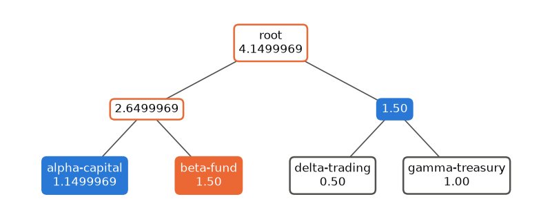

# Module 6: Proof of Reserves

2026-10-10

Previous: [Chapter 5, Trading to Settlement](05-settlement.md) \| [All
chapters](../README.md) \| Next: [Chapter 7, Post-Quantum
Cryptography](07-post-quantum.md)

> [!WARNING]
>
> ### EDUCATIONAL, NOT PRODUCTION
>
> `custody_lab.reserves` is teaching code, written from the published
> constructions and not audited. Its inclusion proofs reveal sibling
> sums to each client. The zero-knowledge schemes in “Formal treatment”
> remove that leak; `dapol` (Rust, DAPOL+) implements one of them and is
> reading material here, not a dependency.

<a id="what-this-chapter-is-for"></a>

## What this chapter is for

After FTX collapsed in November 2022, clients asked custodians and
exchanges one question: do you hold what you owe? Until then, the only
answer most clients received was a balance on a statement, which is a
line in the custodian’s own books and proves nothing about the coins.

A **proof of reserves** answers the question with evidence that clients
can check for themselves. It has two halves:

- **Assets** are public. The custody address and its coins are on the
  chain, and anyone can add them up. What is not public is who controls
  that address: anyone can name an address they do not own. A **proof of
  control** settles it: a signature under the custody key over a message
  that could not have been prepared in advance.
- **Liabilities** are private. Each client’s balance is confidential, so
  the custodian cannot publish the list. It publishes a single
  commitment to all the balances and their total, and gives each client
  a short proof that its own balance is included at its true value. If
  every client checks, the total cannot be understated without some
  client noticing.

Auditors already use the second idea. In a positive confirmation, the
auditor writes to a sample of customers and asks each to confirm its
balance. The comparison stops holding in two places. Every client can
check, not only a sample. And a client who never checks protects nobody:
a custodian can leave out accounts it expects never to be checked.

The demo publishes a snapshot after each settlement batch, in its step
9. The snapshot covers the liabilities’ commitment and total, the
custody key’s balance at a stated block, a FROST signature by the same
2-of-3 cluster that signs settlements, and the head of the policy audit
log from [chapter 4](04-policy.md).

By the end of this chapter the following should be clear:

- how a Merkle tree commits to a list with one hash, and why an
  inclusion proof needs only one sibling per level;
- how a Merkle sum tree adds the totals, and why each parent must commit
  to both children’s sums, shown by the published attack on a tree that
  does not;
- what salts protect and what an inclusion proof still reveals;
- how a proof of control works, and why its signature can never
  authorise a transaction;
- what a proof of reserves proves, and the four things it does not.

<a id="first-principles"></a>

## First principles

This section assumes [chapter 1](01-foundations.md)’s hash functions and
[chapter 2](02-mpc-custody.md)’s commitments.

<a id="hash-trees"></a>

### Hash trees

**The problem.** A custodian with a million clients wants to commit
publicly to the full list of balances without publishing it, and to let
each client check its own entry with a short proof. Hashing the whole
list into one value commits to it, but then a client could check its
entry only by receiving the whole list.

**The idea.** Hash the items in pairs, then hash the pair hashes in
pairs, and continue until one hash remains. That last hash is the
**Merkle root** of a **Merkle tree** (Merkle 1987). Changing any item
changes its hash, which changes its parent’s hash, and so on up to the
root.

To show that one item is in the tree, it is enough to give the item and,
at each level, the hash of its **sibling**, the other child of the same
parent. The verifier recomputes each parent in turn and compares the
last one with the published root. That list of siblings is an
**inclusion proof**. It has one entry per level, so a tree over $n$
items needs about $\log_2 n$ siblings: 10 for a thousand clients, 20 for
a million. The proof stays tiny however large the list grows.

**Worked in code**, with four items A, B, C and D. The root is
$H(H(h_A \,\|\, h_B) \,\|\,
H(h_C \,\|\, h_D))$. The proof for B is two hashes: $h_A$, its sibling,
and $H(h_C \,\|\, h_D)$, its parent’s sibling.

``` python
import hashlib


def H(*parts: bytes) -> bytes:
    return hashlib.sha256(b"".join(parts)).digest()


hA, hB, hC, hD = (H(x) for x in (b"A", b"B", b"C", b"D"))
root = H(H(hA, hB), H(hC, hD))
proof_for_B = [hA, H(hC, hD)]  # one sibling per level
recomputed = H(proof_for_B[0], H(b"B"))  # B's parent
recomputed = H(recomputed, proof_for_B[1])  # the root
assert recomputed == root
assert H(proof_for_B[0], H(b"X")) != H(hA, hB)  # a different item fails at the first level
print(f"root {root.hex()[:16]}...; B proved with {len(proof_for_B)} sibling hashes")
```

    root 1b3faa3fcc5ed50c...; B proved with 2 sibling hashes

The verifier never saw C or D, only one hash standing for both.

Bitcoin uses the same structure twice: a block header commits to the
block’s transactions through a Merkle root, and a Taproot key can commit
to a tree of spending scripts through another ([chapter
5](05-settlement.md)).

**Recap.** A Merkle root commits to a list; an inclusion proof is one
sibling hash per level.

<a id="adding-sums"></a>

### Adding sums

**The problem.** A Merkle root commits to the balances but says nothing
about their total, and the total is the number a proof of reserves
exists to publish.

**The idea.** A **Merkle sum tree** gives every node a sum as well as a
hash. A leaf carries one client’s balance, and each parent carries the
total of its two children. The root’s sum is the total liability. An
inclusion proof now carries each sibling’s sum as well as its hash, and
the client checks that the sums add up along its path as well as the
hashes.

The figure shows the demo’s tree after the [chapter 5](05-settlement.md)
settlement. beta-fund holds 1.50 BTC. Its proof is two siblings:
alpha-capital’s leaf, with sum 1.1499969, and the right-hand parent,
with sum 1.50. beta-fund adds $1.50 + 1.1499969 = 2.6499969$, then
$2.6499969 + 1.50 = 4.1499969$, and checks the hashes at each step
against the published root.

<div id="fig-sum-tree">



Figure 1: The demo’s liabilities after settlement as a Merkle sum tree,
in BTC. beta-fund (orange) receives the two blue siblings as its proof.
It recomputes the outlined nodes and compares the result with the
published root.

</div>

**Sums must never be negative.** A custodian allowed a negative sibling
sum could invent a client with a negative balance, cancel real balances
with it, and publish a smaller total. The verifier refuses any negative
sum, and the tree refuses negative balances.

**Recap.** In a sum tree every node carries its subtree’s total, the
root’s sum is the total owed, and a client checks the sums as well as
the hashes along its path.

<a id="what-each-parent-must-commit-to"></a>

### What each parent must commit to

**The problem.** It matters exactly what goes into each parent’s hash.
Gregory Maxwell’s original sum tree hashed each parent’s total but not
its two children’s individual sums. Hu, Zhang and Guo (2019) showed that
this lets a custodian understate its liabilities.

**The attack, worked by hand.** Two clients: alice with 1 BTC and bob
with 3 BTC. The custodian wants to publish a total of 3 instead of 4.

|  | Honest | Custodian’s claim |
|----|----|----|
| Published total | 4 | 3, the larger of the two balances |
| Sibling sum shown to alice | 3 (bob) | $3 - 1 = 2$ |
| Sibling sum shown to bob | 1 (alice) | $3 - 3 = 0$ |
| Parent hash | $H(4 \,\|\, h_A \,\|\, h_B)$ | $H(3 \,\|\, h_A \,\|\, h_B)$ |

Each client adds its own balance to the sibling sum it was shown: alice
gets $1 + 2 = 3$ and bob $3 + 0 = 3$. Each recomputes
$H(3 \,\|\, h_A \,\|\, h_B)$, which is exactly the published root. Both
checks pass, and 1 BTC of liabilities has disappeared. The lie works
because the parent hash covers only the total, so the custodian can
split that total between the two children differently for each client.

**The fix.** The tree in this chapter hashes both children’s sums into
each parent: $H(h_A \,\|\, s_A \,\|\, h_B \,\|\, s_B)$. Now alice
recomputes $H(h_A \,\|\, 1 \,\|\, h_B \,\|\, 2)$ and bob recomputes
$H(h_A \,\|\, 0 \,\|\, h_B \,\|\, 3)$. Those are different hashes, so at
most one of them can equal the published root, and the other client
detects the lie. The code walkthrough runs both versions.

**Recap.** Each parent’s hash must bind both children’s sums, or the
custodian can show different splits to different clients.

<a id="salts-and-what-a-proof-reveals"></a>

### Salts and what a proof reveals

**The problem.** A leaf’s hash covers a client identifier and a balance.
Both come from guessable sets: client identifiers are often known, and
balances are numbers in a narrow range. Anyone could test candidate
balances against a published leaf hash until one matched, as with the
unsalted commitment in [chapter 2](02-mpc-custody.md).

**The idea.** Each leaf hashes a random 32-byte **salt** together with
the client’s identifier and balance. Without the salt the search is
impossible. The salts are new in every snapshot, and each client
receives only its own, so an observer cannot link a client’s leaves
across snapshots or see that a balance did not change.

**What remains visible.** An inclusion proof reveals its siblings’ sums.
In the figure, beta-fund learns alpha-capital’s exact balance, 1.1499969
BTC, and the combined balance of the other two clients, 1.50 BTC. That
is a real leak, worst in small trees and at the lowest level. The
zero-knowledge schemes in the formal treatment close it. The tree is
padded to a power of two with zero-balance leaves under random hashes,
so the number of real clients is not exact either.

**Recap.** Salts stop balance-guessing; sibling sums still leak, which
zero-knowledge schemes fix.

<a id="proof-of-control"></a>

### Proof of control

**The problem.** A custody address is only an encoding of a key
([chapter 5](05-settlement.md)). A custodian could quote someone else’s
address, or an address whose key it has lost, and point at its coins.

**The idea.** To prove control, the custodian signs a message under the
custody key. The message must be one it could not have signed long in
advance, or a signature made before the key was lost or sold would still
pass, so the demo’s snapshot includes the hash of a recent block. The
signature comes from the same FROST cluster that signs settlements,
under the same Taproot output key, so it also shows the signing quorum
is working.

**The signature must not become a way to move funds.** The demo signs
$H_{\text{attest}}(\text{statement})$, a tagged hash with the tag
`custody-lab/reserves-attestation`. A transaction’s sighash is a tagged
hash with the tag `TapSighash`. Two tagged hashes with different tags
can be equal only through a SHA-256 collision, so no attestation message
can ever be a valid sighash. This separation of message classes by tag
is **domain separation** ([chapter 1](01-foundations.md), “Hash
functions”). The policy engine issues an attestation authorisation
without approvals, because signing a statement moves nothing, and each
signer checks that the authorisation’s message is exactly the one in its
signing package ([chapter 4](04-policy.md)). So an attestation
authorisation can never be used to sign a spend.

**Recap.** A signature under the custody key over a fresh, tagged
statement proves control, and the tag keeps it from ever being a
transaction signature.

<a id="what-a-proof-of-reserves-does-not-show"></a>

### What a proof of reserves does not show

- **Accounts nobody checks.** The total is protected only by clients who
  verify. A custodian can leave out accounts it expects never to be
  checked.
- **Liabilities outside the tree.** Loans, derivatives and other
  obligations do not appear in a tree of client balances.
- **Borrowed assets.** Coins borrowed for the moment of the snapshot and
  returned afterwards pass every check. Frequent snapshots narrow the
  window; the demo publishes one after every settlement batch.
- **Encumbrance.** A signature proves that the key holders signed. It
  does not prove the coins are not pledged elsewhere.

<a id="formal-treatment"></a>

## Formal treatment

<a id="leaves-and-nodes"></a>

### Leaves and nodes

Amounts are whole satoshis encoded as 8-byte big-endian integers,
written $u_{64}(\cdot)$. With tagged hashes $H_{\text{leaf}}$ and
$H_{\text{node}}$ (tags `custody-lab/por-leaf` and
`custody-lab/por-node`):

$$
\text{leaf}_i = \bigl(H_{\text{leaf}}(\text{salt}_i \,\|\, \text{id}_i \,\|\, \text{0x00} \,\|\, u_{64}(b_i)),\; b_i\bigr),
$$

$$
\text{node}(L, R) = \bigl(H_{\text{node}}(h_L \,\|\, u_{64}(s_L) \,\|\, h_R \,\|\, u_{64}(s_R)),\; s_L + s_R\bigr).
$$

Each node is a pair: a hash and a sum. A leaf’s hash covers the salt,
the client identifier, a zero byte that ends the identifier, and the
balance $b_i$. A parent’s hash covers both children’s hashes and both
children’s sums. Leaves are ordered by client identifier, and the tree
is padded to a power of two.

<a id="verification"></a>

### Verification

A client holds $(\text{id}, b, \text{salt})$ and a path of siblings
$(h, s, \text{side})$, where side says whether the sibling is on the
left or the right. It recomputes its leaf, combines it with each sibling
in order, and accepts if and only if every sibling sum is non-negative
and the result equals the published root, hash and sum.

Why this protects the total: given a collision-resistant hash, any two
clients whose paths pass through a node see the same pair of child sums
at that node, because both sums are inside the node’s hash. With sums
non-negative, every node’s sum is then at least the total of the
verified balances below it. So the published total is at least the total
of the balances that clients verified.

<a id="snapshot-and-attestation"></a>

### Snapshot and attestation

A snapshot is the tuple (time, block height, block hash, liabilities
root, liabilities total, client count, assets, custody output key, audit
head). Its **statement** is the canonical JSON of that tuple ([chapter
4](04-policy.md)), and the signed message is

$$
m = H_{\text{attest}}(\text{statement}) .
$$

The published file carries the statement’s fields, $m$, and a BIP340
signature on $m$ under the x-only custody output key $Q$. A third party
needs only the file, SHA-256 and a BIP340 verifier. The reserve ratio is
assets divided by liabilities.

<a id="zero-knowledge-proofs-of-liabilities"></a>

### Zero-knowledge proofs of liabilities

The leak of sibling sums can be closed by replacing each sum with a
**Pedersen commitment** $C = vG + rH$. Here $v$ is the hidden value, $H$
is a second generator whose discrete logarithm relative to $G$ nobody
knows, and $r$ is a random number. The commitment is hiding because of
$r$: for any $v$ there is an $r$ that gives the same $C$. It is binding
because of the discrete logarithm: opening $C$ to a different value
would require knowing how $H$ relates to $G$. Pedersen commitments also
add: $C_1 + C_2$ is a commitment to $v_1 + v_2$, because positions add.
So a parent’s commitment can be the sum of its children’s, and the
tree’s arithmetic works on hidden values.

Hidden values bring back the negative-sum attack, since the verifier can
no longer see a sum. A **range proof** for each commitment shows, in
zero knowledge, that its value lies in $[0, 2^{64})$ without revealing
it, which replaces the check for negative sums.

- **Provisions** (Dagher et al. 2015) also hides the assets: the
  exchange proves control of a subset of a larger set of addresses
  without saying which.
- **DAPOL+** (Ji and Chalkias 2021) defines the security and privacy
  goals of a proof of liabilities and gives a scheme with proofs, using
  a sparse Merkle tree and Bulletproofs range proofs.

<a id="worked-example"></a>

## Worked example

The demo’s ledger after the settlement in [chapter 5](05-settlement.md):
alpha-capital’s 2.00 BTC less the 0.85 BTC it delivered and the
310-satoshi network fee it was charged, and three unchanged balances.
Leaves are sorted by identifier.

| Node           | Children                      | Sum (BTC) |
|----------------|-------------------------------|-----------|
| alpha-capital  |                               | 1.1499969 |
| beta-fund      |                               | 1.50      |
| delta-trading  |                               | 0.50      |
| gamma-treasury |                               | 1.00      |
| left           | alpha-capital, beta-fund      | 2.6499969 |
| right          | delta-trading, gamma-treasury | 1.50      |
| root           | left, right                   | 4.1499969 |

beta-fund’s proof is alpha-capital’s leaf on the left (1.1499969), then
the right node (1.50). Its check is $1.1499969 + 1.50 = 2.6499969$, then
$2.6499969 + 1.50 = 4.1499969$, equal to the published total, together
with the hash at each step. The custody output key held 4.1499969 BTC
after the settlement, so the reserve ratio is exactly 1. The custody
address holds client coins and nothing else, because the fee was charged
to the client ([chapter 8](08-industry.md)).

``` python
from decimal import Decimal

from custody_lab.reserves.merkle_sum import MerkleSumTree, verify

ledger = {
    "alpha-capital": Decimal("2.00") - Decimal("0.85") - Decimal("0.0000031"),  # 310-sat fee
    "beta-fund": Decimal("1.50"),
    "gamma-treasury": Decimal("1.00"),
    "delta-trading": Decimal("0.50"),
}
tree = MerkleSumTree(ledger)
proof = tree.proof("beta-fund")
siblings = [(s.sibling.total, s.sibling_is_left) for s in proof.path]
assert siblings == [(Decimal("1.1499969"), True), (Decimal("1.50"), False)]
assert tree.root.total == Decimal("4.1499969") and verify(proof, tree.root)
assert Decimal("4.1499969") / tree.root.total == 1  # assets read from regtest
print("root total", tree.root.total, "BTC; beta-fund's proof has", len(proof.path), "siblings")
```

    root total 4.1499969 BTC; beta-fund's proof has 2 siblings

<a id="code-walkthrough"></a>

## Code walkthrough

<a id="inclusion-proofs"></a>

### Inclusion proofs

Every client’s proof verifies against the root. A proof altered in its
balance, its salt or a sibling’s sum does not. And a thousand clients
need ten siblings each.

``` python
from dataclasses import replace

from custody_lab.reserves.merkle_sum import Node

assert all(verify(tree.proof(client), tree.root) for client in ledger)
assert not verify(replace(proof, balance=Decimal("1.49999999")), tree.root)
assert not verify(replace(proof, salt=bytes(32)), tree.root)
first = proof.path[0]
negative = replace(first, sibling=Node(first.sibling.hash, -1))
assert not verify(replace(proof, path=(negative, *proof.path[1:])), tree.root)

large = MerkleSumTree({f"client-{i}": Decimal(1) for i in range(1000)})
print("1000 clients:", len(large.proof("client-7").path), "siblings per proof")
```

    1000 clients: 10 siblings per proof

The assertions cover the three alterations: a balance one satoshi lower,
a different salt, and a negative sibling sum. Each is refused.

<a id="the-attack-on-a-total-only-tree"></a>

### The attack on a total-only tree

The cell builds the custodian’s claim from “What each parent must commit
to” against both kinds of parent. Against a parent that hashes only the
total, alice’s and bob’s recomputations reach the same root. Against
this chapter’s parent they reach different roots.

``` python
from custody_lab.foundations.hashing import tagged_hash
from custody_lab.reserves.merkle_sum import NODE_TAG, leaf, parent


def total_only_parent(left: Node, right: Node) -> Node:
    total = left.sats + right.sats
    return Node(tagged_hash(NODE_TAG, total.to_bytes(8, "big") + left.hash + right.hash), total)


alice = leaf("alice", Decimal("1"), bytes(32))
bob = leaf("bob", Decimal("3"), bytes(32))
claimed = max(alice.sats, bob.sats)  # 3 BTC published; 4 BTC owed
one_root = {}
for combine in (total_only_parent, parent):
    seen_by_alice = combine(alice, Node(bob.hash, claimed - alice.sats))
    seen_by_bob = combine(Node(alice.hash, claimed - bob.sats), bob)
    one_root[combine.__name__] = seen_by_alice == seen_by_bob
    print(f"{combine.__name__:>17}: one root satisfies both clients:",
          one_root[combine.__name__])
assert one_root == {"total_only_parent": True, "parent": False}
```

    total_only_parent: one root satisfies both clients: True
               parent: one root satisfies both clients: False

`True` for the total-only parent means the lie passes both clients’
checks; `False` for this chapter’s parent means it cannot.

<a id="the-whole-demo"></a>

### The whole demo

`custody_lab.demo.pipeline.run` drives every module in order on a
throwaway regtest chain: key generation, funding, the FIX session,
netting, policy, signing, broadcast and the reserves snapshot. The
second half of the cell checks the published snapshot with nothing but
the file, the standard library and [chapter 1](01-foundations.md)’s
BIP340 verifier, as an outside party would.

``` python
import json
import tempfile
from pathlib import Path

from custody_lab.demo import pipeline
from custody_lab.foundations import schnorr

events = []
summary = pipeline.run(events.append, Path(tempfile.mkdtemp(prefix="ch6-")))
for event in events:
    if event.status == "done":
        print(f"{event.step:>9}  {event.title}")

document = json.loads(Path(summary["snapshot"]).read_text())
attestation = document.pop("attestation")
ratio = document.pop("reserve_ratio")
statement = json.dumps(document, sort_keys=True, separators=(",", ":")).encode()
prefix = hashlib.sha256(attestation["tag"].encode()).digest()
message = hashlib.sha256(prefix + prefix + statement).digest()
assert message.hex() == attestation["message"]
assert schnorr.verify(
    message,
    bytes.fromhex(document["custody_output_key"]),
    bytes.fromhex(attestation["bip340_signature"]),
)
print(f"liabilities {document['liabilities']} BTC, assets {document['assets']} BTC,")
print(f"reserve ratio {ratio}; proof of control verified from the file")
```

        chain  Start a private Bitcoin Core regtest chain
         keys  Distributed key generation: 2-of-3, one process per share
         fund  Fund the custody address
        trade  FIX 5.0 SP2 trading session with the exchange
          net  Net the settlement cycle into one instruction
       policy  Build the transaction and apply the policy
         sign  Threshold signature from 2 of 3 signer processes
    broadcast  Broadcast and confirm on chain
     reserves  Proof-of-reserves snapshot with proof of control
    liabilities 4.1499969 BTC, assets 4.1499969 BTC,
    reserve ratio 1.00000; proof of control verified from the file

The first nine lines are the demo’s steps, each reported done. The last
two come from the outside check: the file’s liabilities and assets are
equal, and the signature in the file verifies under the custody key it
names.

<a id="how-this-shows-up-in-production"></a>

## How this shows up in production

**After FTX.** Several exchanges published Merkle-tree proofs of
reserves in November and December 2022. The accounting firm Mazars
paused its proof-of-reserves work for crypto clients in December 2022
(**verify current**). A proof of reserves is not an audit: it says
nothing about internal controls, off-book liabilities or encumbrance.

**Broken implementations.** Chalkias, Chatzigiannis and Ji (2022)
reviewed liability proofs used in production and found exploitable
defects: SHA-1, hashes truncated to 8 bytes, Merkle trees built over the
wrong inputs, and no guarantee that user identifiers are unique, which
would let two clients be shown the same leaf.

**Zero-knowledge in production.** Some exchanges publish proofs of
liabilities based on zk-SNARKs, a family of compact zero-knowledge
proofs, that hide individual balances (**verify current**). `dapol` is
an open-source Rust implementation of DAPOL+ (**verify current** for
maintainer and status).

**Custodians and exchanges differ.** A qualified custodian is examined
by auditors under frameworks such as SOC 2 ([chapter
8](08-industry.md)). A published proof of reserves adds evidence that a
client can check for itself, between audits.

**Frequency and anchoring.** The demo publishes a snapshot per
settlement batch and anchors the policy audit head in it ([chapter
4](04-policy.md)). A copy of the audit log truncated or rewritten at or
before the anchored entry then no longer contains a head that was
already published. Entries written after the latest snapshot are covered
only by the next one, so the frequency of snapshots also sets how long a
rewrite of the newest entries goes unnoticed ([chapter 4](04-policy.md),
“A forger’s copy and the anchored head”).

<a id="recap"></a>

## Recap

1.  A proof of reserves has two halves: assets, which are public on the
    chain, and liabilities, which are private and must be committed to
    without being published.
2.  A Merkle tree commits to a list with one root hash, and an inclusion
    proof needs one sibling hash per level: 20 for a million clients.
3.  A Merkle sum tree adds totals; the root’s sum is the total owed.
    Sums must be non-negative.
4.  Each parent’s hash must cover both children’s sums. A tree that
    hashes only the total lets a custodian show each client a different
    split and hide liabilities.
5.  Salts stop anyone guessing balances from leaf hashes. Sibling sums
    still leak, which Pedersen commitments with range proofs remove.
6.  Proof of control is a signature by the custody key over a fresh
    statement; its tag means it can never be a transaction signature.
7.  A proof of reserves does not cover clients who never check,
    liabilities outside the tree, borrowed assets or encumbrance.

[Chapter 7](07-post-quantum.md) asks what a quantum computer would break
in all of this, and how a custodian would migrate.

<a id="exercises"></a>

## Exercises

1.  **Recall.** How many siblings does an inclusion proof carry in a
    tree over 1,000,000 clients?
2.  **Compute.** In the worked example, list delta-trading’s siblings
    with their sides and sums, and check its path by hand.
3.  **Attack.** In a total-only tree with alice at 2 BTC and bob at 5
    BTC, what total can the custodian publish while both clients’ checks
    pass, and which sibling sums does it show each client? What happens
    against this chapter’s tree?
4.  **Explain.** Why does each leaf include a random salt, and why is
    the salt new in every snapshot?
5.  **Design.** A custodian borrows 1,000 BTC for an hour around each
    snapshot. Which parts of the snapshot does this defeat, and what
    reduces the exposure?
6.  **Explain.** The policy engine issues attestation authorisations
    without approvals. Why can a compromised coordinator holding one not
    move funds?

<a id="solutions"></a>

## Solutions

1.  $2^{20} = 1{,}048{,}576 \ge 10^6$, so the padded tree has 20 levels
    below the root and each proof carries 20 siblings.

``` python
assert (2**19 < 1_000_000 <= 2**20) and len(large.proof("client-0").path) == 10
```

2.  gamma-treasury on the right (1.00), then the left node on the left
    (2.6499969). The check is $0.50 + 1.00 = 1.50$, then
    $2.6499969 + 1.50 = 4.1499969$, which equals the published total.

``` python
path = [(s.sibling.total, s.sibling_is_left) for s in tree.proof("delta-trading").path]
assert path == [(Decimal("1.00"), False), (Decimal("2.6499969"), True)]
```

3.  The custodian can publish 5 BTC, the larger balance. It shows alice
    a sibling sum of $5 - 2 = 3$ and bob a sibling sum of $5 - 5 = 0$,
    and both recompute $H(5 \,\|\, h_A \,\|\, h_B)$. Against this
    chapter’s tree, alice recomputes
    $H(h_A \,\|\, 2 \,\|\, h_B \,\|\, 3)$ and bob
    $H(h_A \,\|\, 0 \,\|\, h_B \,\|\, 5)$. At most one matches the
    published root.

``` python
a2, b5 = leaf("alice", Decimal("2"), bytes(32)), leaf("bob", Decimal("5"), bytes(32))
top = max(a2.sats, b5.sats)
assert total_only_parent(a2, Node(b5.hash, top - a2.sats)) == total_only_parent(
    Node(a2.hash, top - b5.sats), b5
)
assert parent(a2, Node(b5.hash, top - a2.sats)) != parent(Node(a2.hash, top - b5.sats), b5)
```

4.  Without a salt, a leaf hash is a hash of a client id and a balance,
    both from small or guessable sets, and anyone can test candidate
    balances against it. The salt makes that search infeasible. A new
    salt per snapshot stops an observer from linking one client’s leaves
    across snapshots, or from seeing that a balance is unchanged.
5.  It defeats the asset half: the coins are under the custody key when
    the signature is made, so the proof of control and the reserve ratio
    pass. It does not affect the liability half. More frequent or
    unannounced snapshots, snapshots taken at a past block the custodian
    did not choose, and on-chain monitoring of large inflows and
    outflows around each snapshot all reduce the exposure.
6.  The authorisation names one message,
    $H_{\text{attest}}(\text{statement})$, and each signer refuses to
    sign any other message with it ([chapter 4](04-policy.md)). A
    transaction sighash is a tagged hash under a different tag, so it
    cannot equal an attestation message without a SHA-256 collision.

<a id="further-reading"></a>

## Further reading

- R. C. Merkle, “A Digital Signature Based on a Conventional Encryption
  Function”, CRYPTO 1987. The hash tree.
- K. Hu, Z. Zhang, K. Guo, “Breaking the Binding: Attacks on the Merkle
  Approach to Prove Liabilities and its Applications”, *Computers &
  Security*, 2019 (IACR ePrint 2018/1139). The attack in “What each
  parent must commit to”.
- G. G. Dagher, B. Bünz, J. Bonneau, J. Clark, D. Boneh, “Provisions:
  Privacy-preserving Proofs of Solvency for Bitcoin Exchanges”, ACM CCS
  2015 (IACR ePrint 2015/1008).
- Y. Ji, K. Chalkias, “Generalized Proof of Liabilities”, ACM CCS 2021
  (IACR ePrint 2021/1350). DAPOL+, with definitions of what a proof of
  liabilities must achieve.
- K. Chalkias, P. Chatzigiannis, Y. Ji, “Broken Proofs of Solvency in
  Blockchain Custodial Wallets and Exchanges”, 2022 (IACR ePrint
  2022/043). Defects found in production systems.

------------------------------------------------------------------------

Previous: [Chapter 5, Trading to Settlement](05-settlement.md) \| [All
chapters](../README.md) \| Next: [Chapter 7, Post-Quantum
Cryptography](07-post-quantum.md)
