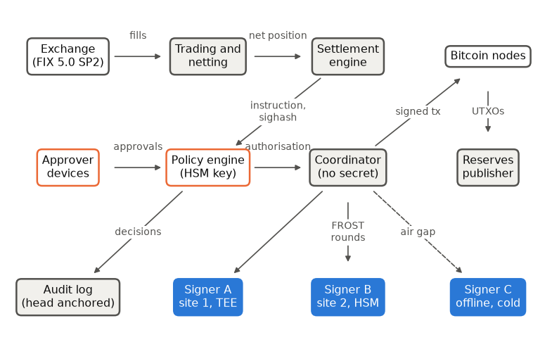

# Module 9: Capstone: Designing a Custody System

2026-10-08

Previous: [Chapter 8, Industry and Regulation](08-industry.md) \| [All
chapters](../README.md)

> [!WARNING]
>
> ### EDUCATIONAL, NOT PRODUCTION
>
> The architecture in this chapter is a teaching composite built from
> the demo and the placements of [chapter 3](03-key-storage.md). It is
> not a reviewed production design. The cells run the demo’s signing
> cluster (Zcash Foundation `frost-secp256k1-tr` through
> `custody_frost`) and its policy and settlement code.

<a id="what-this-chapter-is-for"></a>

## What this chapter is for

The manual has built a custody system one part at a time: keys and
signatures ([chapter 1](01-foundations.md)), threshold signing ([chapter
2](02-mpc-custody.md)), where keys live ([chapter
3](03-key-storage.md)), the policy engine ([chapter 4](04-policy.md)),
the settlement path ([chapter 5](05-settlement.md)), the proof of
reserves ([chapter 6](06-reserves.md)), the post-quantum migration
([chapter 7](07-post-quantum.md)) and the rules it must meet ([chapter
8](08-industry.md)). Each chapter answered its own question. This
chapter asks whether the parts make a sound system: what each part
holds, what an attacker gains by compromising it, what happens when it
fails, and what each design choice costs.

It does this as a system design review, run as questions and answers.
Each answer names the chapter that builds the part it relies on, so the
chapter also works as a map back into the manual. The demo is the
starting point, and the review describes how a production deployment
would differ from it.

By the end of this chapter the following should be clear:

- the custody architecture end to end, from a FIX fill to a published
  proof of reserves;
- what each component holds, and what its compromise alone gives an
  attacker;
- the difference between safety and liveness, and why a threshold of
  independent sites improves both;
- the main design decisions against their alternatives, with the cost of
  each;
- the failure modes by component, each with its class, detection and
  response;
- the sizes and counts the design rests on, computed from the project’s
  code.

<a id="first-principles"></a>

## First principles

<a id="how-a-design-review-runs"></a>

### How a design review runs

**The idea.** A system design review runs in a fixed order: the
requirements and the assumptions behind them, the architecture, deep
dives into the decisions that matter, the failure modes, and the
trade-offs. The order matters because each step depends on the one
before: a failure mode is only a failure against a stated requirement,
and a trade-off only makes sense once the failure it accepts is known.

A FIX engineer has sat through the same review for a new gateway: the
session layer, sequence numbers, recovery after a disconnect, pre-trade
risk checks. The comparison stops holding at the last step. A gateway
that sends a bad order can ask for a cancel, and an exchange can bust a
trade. A custody signature cannot be recalled, so every check the review
asks for has to happen before signing.

<a id="safety-and-liveness"></a>

### Safety and liveness

**The idea.** Every requirement of a custody system falls into one of
two classes:

- **Safety** means nothing bad happens: no signature without
  authorisation, no loss of funds.
- **Liveness** means something good eventually happens: every approved
  settlement completes.

The two pull against each other. Requiring more signers makes theft
harder and makes signing fail more often; refusing anything unclear
protects funds and stops legitimate payments. A custodian can recover
from a liveness failure, since a delayed settlement can be retried, and
cannot recover from a safety failure, since a stolen coin is gone. So
where the two conflict, the design chooses safety, and a component in
doubt refuses: default deny ([chapter 4](04-policy.md)).

**A threshold improves both, if the sites are independent.** Suppose
each signing site is available 99 percent of the time and, separately,
has a 1 percent chance of being compromised in a year, and suppose the
sites fail independently of each other. A single key is then available
99 percent of the time and compromised with probability 1 percent. With
2-of-3, signing needs any two of three sites up, and theft needs any two
of three compromised:

- **available:** all three up, or exactly two up:
  $0.99^3 + 3 \times 0.99^2 \times 0.01 \approx 0.9997$;
- **compromised:** all three, or exactly two:
  $0.01^3 + 3 \times 0.01^2 \times 0.99 \approx 0.0003$.

Availability rises from 99 to 99.97 percent and the chance of theft
falls from 1 in 100 to about 3 in 10,000, at the same time. The whole
gain rests on independence. If one administrator can reach all three
sites, they fail together, and 2-of-3 is no safer than one key. That is
why the design puts signers at independent sites under separate
administration.

``` python
from math import comb


def at_least(k: int, n: int, p: float) -> float:
    """Probability that at least k of n independent sites are in a state of probability p."""
    return sum(comb(n, j) * p**j * (1 - p) ** (n - j) for j in range(k, n + 1))


print(f"{'scheme':<8}{'can sign':>12}{'compromised':>14}")
for t, n in [(1, 1), (2, 3), (3, 5)]:
    print(f"{t}-of-{n}{at_least(t, n, 0.99):>14.6f}{at_least(t, n, 0.01):>14.2e}")
assert at_least(2, 3, 0.99) > 0.9997 and at_least(2, 3, 0.01) < 0.0003
```

    scheme      can sign   compromised
    1-of-1      0.990000      1.00e-02
    2-of-3      0.999702      2.98e-04
    3-of-5      0.999990      9.85e-06

The rows compare one key, 2-of-3 and 3-of-5 under the same per-site
figures. Each larger threshold signs more reliably and is harder to
compromise, as long as the independence assumption holds; the per-site
figures are illustrations, not measurements.

**Recap.** Safety failures are permanent and liveness failures are not,
so the design refuses when in doubt. A threshold of independent sites
improves both; shared administration erases the gain.

<a id="the-brief"></a>

## The brief

**Q.** Design custody for institutional clients that trade bitcoin on an
exchange without moving their coins to it. Settle once a day, and let
every client check that its coins are held.

**A.** First, the assumptions the design will rest on. They come first
because every later answer depends on them: the attacker list decides
how many independent sites are needed, and the traffic figure decides
that a signing protocol taking seconds is acceptable.

| Question | Assumption |
|----|----|
| Which assets? | Bitcoin first. Ethereum-family chains next, which changes the signing protocol |
| How much traffic? | Tens of settlements a day; each must finish within its cycle, in minutes, not milliseconds |
| Which attackers? | Insiders, administrators included; external attackers; a cloud provider. Not one party with physical access to every site |
| Which regulation? | A MiCA crypto-asset service provider in the EU, or a qualified custodian in the US ([chapter 8](08-industry.md)) |
| Recovery objectives? | Settlements continue after the loss of any one site. No loss of funds after the compromise of any one site or any one person |
| What do clients see? | An inclusion proof for their balance after each settlement batch |

The recovery objectives are a liveness requirement (settlements continue
after any one site is lost) and a safety requirement (no loss after any
one site or person is compromised). A 2-of-3 threshold across
independent sites meets both, as the first-principles section showed;
where they conflict, safety wins.

<a id="architecture"></a>

## Architecture

<div id="fig-architecture">



Figure 1: The production architecture. Orange outlines hold a secret
that authorises; blue boxes hold one key share each. The coordinator
holds nothing secret. Signer C is offline and is reached through an air
gap.

</div>

The figure separates three kinds of component by colour. Blue boxes hold
one key share each, at three independent sites, one of them offline.
Orange outlines hold a secret that authorises something: the approvers’
keys and the policy engine’s authority key. White boxes, the exchange
and the Bitcoin nodes, are outside the custodian. Grey boxes hold
nothing secret, so compromising one of them can delay or misdirect work
but cannot by itself produce a signature. The arrows follow one
settlement from the exchange’s fills at the top left to the signed
transaction and the reserves snapshot on the right.

**Q.** Walk through one settlement.

**A.** Eight steps, each built in an earlier chapter:

1.  The exchange fills orders and sends execution reports over FIX
    ([chapter 5](05-settlement.md)).
2.  Trading nets the cycle’s fills into one obligation per asset
    ([chapter 5](05-settlement.md)).
3.  The settlement engine builds the Bitcoin transaction and its
    sighash, and checks the transaction against the instruction: exact
    amount, change only to custody, fee under a cap ([chapter
    5](05-settlement.md)).
4.  The policy engine evaluates the instruction with default deny:
    asset, tier quorum of approvals signed on the approvers’ own
    devices, whitelist, velocity limit. It then issues an authorisation
    that names the exact sighash ([chapter 4](04-policy.md)).
5.  The coordinator runs FROST with any two signers. Each signer checks
    the authorisation before producing its share ([chapter
    2](02-mpc-custody.md)).
6.  The coordinator aggregates one 64-byte signature and broadcasts the
    transaction (chapters [2](02-mpc-custody.md) and
    [5](05-settlement.md)).
7.  The reserves publisher builds the liabilities tree, reads the
    custody balance at a block, and has the same signing cluster sign
    the snapshot as proof of control ([chapter 6](06-reserves.md)).
8.  Every decision lands in the hash-chained audit log, whose head the
    snapshot carries (chapters [4](04-policy.md) and
    [6](06-reserves.md)).

**Q.** What does each component hold, and what does its compromise give
an attacker?

| Component | Holds | Compromise alone gives |
|----|----|----|
| Trading and netting | Positions | A wrong instruction, which approvers and the whitelist must catch |
| Settlement engine | Nothing secret | Proposals only; it cannot authorise |
| One approver device | One approval key | One approval; every tier above the lowest needs a second person |
| Policy engine | The authority key, in an HSM | Any authorisation the signers accept: the most valuable key after the shares |
| Coordinator | Nothing secret | Denial of service; it cannot sign |
| One signer | One share | Nothing below the threshold |
| Audit log | An integrity-protected record | Tampering that the hash chain and the anchored head reveal |
| Reserves publisher | Nothing secret | Withholding a snapshot; it cannot forge one, which needs the threshold key |

<a id="deep-dives"></a>

## Deep dives

**Q.** Why threshold signing instead of on-chain multisig?

**A.** A FROST key-path spend is one 64-byte signature under one key.
The output looks like any single-key output, pays the fee of a
single-key spend, and reveals nothing about the signer set. Shares can
be refreshed without moving coins. Multisig is enforced by the chain
itself: the policy is auditable on chain, there is no protocol to get
wrong, and every wallet supports it. Its costs are larger transactions
and a public signer set. The demo takes threshold signing and accepts
the protocol risk: the FROST crate it uses is outside the NCC Group
audit scope ([chapter 2](02-mpc-custody.md), Exercise 5).

**Q.** Why FROST, and what changes for Ethereum?

**A.** Taproot accepts BIP340 Schnorr signatures, and FROST produces
them in two rounds, the first of which does not depend on the message.
Ethereum verifies ECDSA. Threshold ECDSA (Lindell 2017 for two parties,
CGGMP for more) needs more rounds and zero-knowledge proofs over
Paillier encryption, and its implementations have the flaw history
[chapter 2](02-mpc-custody.md) records (BitForge, TSSHOCK).

**Q.** How does a signer decide to sign?

**A.** It checks the authorisation token:

- both signatures, Ed25519 and ML-DSA-65, under the policy authority’s
  key;
- the expiry;
- that the token names exactly the message inside the FROST signing
  package;
- that this signer has not used the token before.

The signer never parses the transaction or the business instruction; the
policy engine did that. The consequence is that the authority key is as
valuable as a threshold of shares, and it belongs in an HSM ([chapter
3](03-key-storage.md)). A further layer, not in the demo, has each
signer re-check the destination against a whitelist signed by a separate
quorum.

**Q.** Why two quorums?

**A.** The approval quorum is people; the signing quorum is machines.
Compromising an approver yields no share, and compromising a signer
yields no approval. An attacker needs both kinds of compromise at once
([chapter 4](04-policy.md)).

**Q.** Hot, warm and cold?

**A.** Tiers by value and response time:

- a **hot wallet** signs automatically under policy, online, within
  small velocity limits;
- a **warm wallet** has online signers but a human approval quorum for
  every transaction;
- **cold storage** keeps at least one required share offline, reached
  through an air gap in a scheduled ceremony, and holds most of the
  assets.

The demo is warm. Its policy tiers, one approval up to 0.1 BTC and two
up to 10 BTC, apply the same idea at the approval layer.

**Q.** Describe the key lifecycle.

**A.**

- **Creation.** Distributed key generation, with no dealer ([chapter
  2](02-mpc-custody.md)).
- **Maintenance.** Proactive refresh: new shares for the same key, so a
  stolen old share becomes useless ([chapter 2](02-mpc-custody.md)).
- **Backup.** Each share encrypted to an offline recovery key, with
  ML-KEM combined with X25519 for long-term secrecy ([chapter
  7](07-post-quantum.md)).
- **Recovery.** A witnessed ceremony that restores a share from its
  backup.
- **Rotation.** A new key means moving every coin to it: a **sweep**,
  which is itself a settlement through the full policy path.

Nonces are never backed up, because a restored nonce signs twice
([chapter 2](02-mpc-custody.md)).

**Q.** What do clients get, and what does it not show?

**A.** After each batch, a snapshot: liabilities root and total, assets
at a stated block, proof of control, and the audit log head. Each client
can check its own inclusion. The snapshot does not show liabilities left
out of the tree, assets pledged elsewhere, or anything that happened
between snapshots ([chapter 6](06-reserves.md)).

**Q.** Where does quantum risk sit?

**A.** In the order [chapter 7](07-post-quantum.md) gives. Backups and
recorded traffic are exposed now, so their encryption moves first.
Internal signatures are the custodian’s to change, and the demo’s
authorisations are already hybrid. The chain moves last, when Bitcoin
adopts a post-quantum output type. Until then a Taproot key-path output
shows its key on chain from the moment it is created.

<a id="failure-modes"></a>

## Failure modes

**Q.** What can go wrong, and what happens then?

**A.** The table lists the failures by component. *Class* says what is
at risk: safety (money or integrity), liveness (availability only), or
both. *Detection* is how operators find out, and *response* is what they
do. Three terms in it need defining first. **Replace-by-fee** (**RBF**)
rebroadcasts a transaction with a higher fee that spends the same
inputs. **Child-pays-for-parent** (**CPFP**) spends the stuck
transaction’s change in a new transaction whose fee pays for both. A
**chain reorganisation** replaces recent blocks with a longer competing
branch, which can remove a confirmed transaction.

| Failure | Class | Detection | Response |
|----|----|----|----|
| One signer down | Liveness | No reply in round 1 | Sign with another pair: any $t$ of $n$ can sign |
| Signer restarts mid-session | Liveness | “no nonces: commit first” | Restart the session; nonces are never restored |
| Signer restart empties its used-token set, once shares persist | Safety, bounded | None; the set is in memory | A replay is limited to the token’s expiry and its one message; persist the set with the share |
| One signer compromised | Safety, contained | Attestation mismatch; unexpected behaviour | Proactive refresh; rebuild the site |
| $t$ signers compromised | Safety, lost | An unexpected spend on chain | Sweep whatever remains to a new key; the design makes this require $t$ independent sites |
| Coordinator compromised | Liveness | Signers refuse bad requests | Replace it; it holds nothing |
| Authority key stolen | Safety | Authorisations with no matching decision in the audit log | Replace the authority key at every signer; keep it in an HSM |
| One approver key stolen | Safety, contained | Approvals from an unexpected device or time | The quorum needs a second person; velocity limits bound the loss; revoke the key |
| Nonce reuse after a restore | Safety, key lost | Two signatures with the same $R$ | Never persist nonces; the signer erases them before its checks |
| Clock skew between engine and signers | Both | Valid tokens refused, or expired ones accepted | Expiry short but longer than the worst skew; monitor clocks. Virtual machines can step their clocks by seconds |
| Fee spike, transaction stuck | Liveness | Unconfirmed after the expected blocks | Replace-by-fee or child-pays-for-parent, each a new authorised transaction under the fee cap |
| Chain reorganisation | Settlement status | The confirming block leaves the best chain | Treat a settlement as final only after enough confirmations |
| Exchange defaults mid-cycle | Credit | A missed settlement | Exposure is one cycle’s net position; the coins never left custody ([chapter 5](05-settlement.md)) |
| Audit log altered | Integrity | The hash chain breaks; the anchored head differs | Verify the chain; each snapshot carries the head (chapters [4](04-policy.md) and [6](06-reserves.md)) |

The third row comes from reading the demo’s signer code: each signer
keeps its used-token set in process memory. In the demo a restart also
loses the share, which lives in the same memory, so the restarted signer
cannot sign at all. The row applies to a deployment whose shares survive
a restart, sealed or behind an HSM ([chapter 3](03-key-storage.md)). Two
properties bound the damage there. A token expires, and it names one
exact message. A replay therefore yields another signature on a message
that was already authorised, never on a new one.

<a id="trade-offs"></a>

## Trade-offs

**Q.** What did each major decision cost?

**A.** Every row names the choice, the main alternative, and what the
choice gives up. None of the costs is hidden: each appears somewhere in
the failure table or in an earlier chapter.

| Decision | Chosen | Alternative | Cost of the choice |
|----|----|----|----|
| Threshold | FROST 2-of-3, Taproot | 2-of-3 multisig | Protocol and implementation risk; a crate outside the audit scope |
| Signer placement | Three independent sites, one offline | Three enclaves in one cloud | Operating cost; cold signing is slow |
| Policy location | Engine with an HSM key; signers check the token | Full policy inside each signer | The authority key is a single point, covered by the HSM and the audit log |
| Authorisation signature | Hybrid Ed25519 and ML-DSA-65 | Ed25519 alone | Tokens of several kilobytes |
| Settlement | Net once per cycle, off exchange | Gross, per fill | Credit exposure of one cycle, for fewer transactions and fees |
| Liabilities proof | Merkle sum tree per batch | Zero-knowledge proof of liabilities | Siblings’ sums revealed to each client; no proving system to operate |
| Custody address | One omnibus Taproot address | An address per client | Segregation lives in the ledger, not on chain ([chapter 8](08-industry.md)) |

<a id="worked-example"></a>

## Worked example

The numbers the design rests on, computed from the libraries rather than
quoted:

``` python
import hashlib
import math
from datetime import UTC, datetime, timedelta

from custody_lab.policy import authorisation
from custody_lab.policy.authorisation import AuthorityKey
from custody_lab.settlement import transfer

authority = AuthorityKey.generate()
token = authorisation.issue(authority, bytes(32), bytes(32),
                            datetime.now(UTC) + timedelta(minutes=1))
numbers = {
    "settlement vsize, 1 input 2 outputs (vB)": transfer.estimated_vsize(1, 2),
    "settlement fee at 2 sat/vB (sats)": transfer.estimated_vsize(1, 2) * 2,
    "each further key-path input (vB)": transfer.estimated_vsize(2, 2)
    - transfer.estimated_vsize(1, 2),
    "authority public key (bytes)": len(authority.public_bytes()),
    "serialised authorisation token (bytes)": len(token.to_bytes()),
    "inclusion proof, 10^6 clients (siblings)": math.ceil(math.log2(10**6)),
}
assert numbers["settlement fee at 2 sat/vB (sats)"] == 310
for name, value in numbers.items():
    print(f"{name:<44}{value:>8,}")
```

    settlement vsize, 1 input 2 outputs (vB)         155
    settlement fee at 2 sat/vB (sats)                310
    each further key-path input (vB)                  58
    authority public key (bytes)                   1,984
    serialised authorisation token (bytes)         7,047
    inclusion proof, 10^6 clients (siblings)          20

Reading the rows: a one-input settlement is 155 virtual bytes, so 310
satoshis at 2 satoshis per virtual byte, and each further input adds 58
bytes, which is what makes an address per client expensive (Exercise 6).
The authority key and the token are dominated by ML-DSA-65. The
inclusion proof for a million clients is 20 siblings. [Chapter
6](06-reserves.md)’s demo paid exactly this 310-sat fee. The token is
large because it carries an ML-DSA-65 signature of 3,309 bytes and is
serialised as hexadecimal text; a binary encoding would halve it.

<a id="code-walkthrough"></a>

## Code walkthrough

<a id="any-two-of-three-and-a-replay"></a>

### Any two of three, and a replay

The demo’s cluster signs one message with signers 1 and 3, then with
signers 2 and 3, each time under a fresh authorisation. Both signatures
verify under the same group key, which is what lets the design lose any
one site. Signers 1 and 2 then receive the first authorisation again,
and signer 1 refuses it.

``` python
from custody_lab.foundations import schnorr
from custody_lab.mpc.cluster import SigningCluster

message = hashlib.sha256(b"settle-cycle-1").digest()


def authorise(msg: bytes) -> bytes:
    expiry = datetime.now(UTC) + timedelta(minutes=1)
    return authorisation.issue(authority, bytes(32), msg, expiry).to_bytes()


with SigningCluster(2, 3, authority=authority.public_bytes()) as cluster:
    group_key = cluster.dkg()
    first = authorise(message)
    for signers, token_bytes in (([1, 3], first), ([2, 3], authorise(message))):
        signature = cluster.sign(message, signers, token_bytes)
        assert len(signature) == 64 and schnorr.verify(message, group_key, signature)
        print(f"signers {signers}: valid 64-byte signature under one group key")
    try:
        cluster.sign(message, [1, 2], first)
        raise AssertionError("a used authorisation was accepted")
    except RuntimeError as refused:
        print("replay to signers [1, 2] refused:")
        print(" ", refused)
```

    signers [1, 3]: valid 64-byte signature under one group key
    signers [2, 3]: valid 64-byte signature under one group key
    replay to signers [1, 2] refused:
      signer 1: AuthorisationRejected('authorisation already used')

Signer 2 had not seen the first token and produced its share. Signer 1
had, and refused, so no signature formed: with two signers required, one
refusal is enough. Exercise 3 asks when that stops being true.

<a id="how-this-shows-up-in-production"></a>

## How this shows up in production

What a production build adds to the demo, each named in an earlier
chapter:

- mutually authenticated channels between coordinator and signers, with
  unique session identifiers ([chapter 2](02-mpc-custody.md));
- a persistent used-token store at each signer, and a “freeze key”
  action wired to signing failures, not a retry loop ([chapter
  2](02-mpc-custody.md));
- the placements of [chapter 3](03-key-storage.md): shares in enclaves
  or behind HSMs at independent sites, the authority key in an HSM,
  approval keys on personal devices;
- witnessed key ceremonies and tested recovery, with each share’s backup
  under its own recovery key;
- a signing path for each chain family: FROST for Taproot, threshold
  ECDSA for Ethereum;
- RBF and CPFP handling, and settlement status that follows
  confirmations and reorganisations;
- client statements, a per-movement register and prompt return of
  assets, to the standard of MiCA Article 75 ([chapter
  8](08-industry.md));
- a SOC 2 Type II period of operating evidence for the controls above.

<a id="recap"></a>

## Recap

1.  A design review runs in order: requirements and assumptions,
    architecture, deep dives, failure modes, trade-offs.
2.  Safety failures lose money and cannot be undone; liveness failures
    delay work and can be retried. Where they conflict, the design
    refuses.
3.  A threshold across independent sites raises availability and lowers
    the chance of theft at the same time; shared administration erases
    both gains.
4.  Each component’s compromise is bounded: the coordinator, settlement
    engine and reserves publisher hold nothing secret, one signer or one
    approver is below its threshold, and the authority key, the most
    valuable secret after the shares, belongs in an HSM.
5.  The failure table separates what loses money from what only delays
    it, and pairs each failure with its detection and response.
6.  Each major decision has a stated cost: protocol risk for threshold
    signing, operating cost for independent sites, kilobyte tokens for
    hybrid signatures, one cycle of credit exposure for netting.

<a id="exercises"></a>

## Exercises

1.  **Recall.** Which components hold a secret, and what does each
    secret let an attacker do alone?
2.  **Compute.** In a 2-of-5 cluster, how many different signer pairs
    can sign? How many remain with two sites down?
3.  **Explain.** In 2-of-5, the coordinator sends one authorisation to
    signers 1 and 2, and then to signers 3 and 4. Does per-signer single
    use stop the second signature? Does it matter?
4.  **Apply.** The full policy check moves inside each signer: every
    signer holds the whitelist and the quorum rules and checks the
    approvals itself. Which rows of the failure table change?
5.  **Design.** Add Ethereum. What changes in the signing path, the
    policy engine and the proof of reserves?
6.  **Design.** A regulator requires an address per client. What does
    that cost in fees, in the proof of reserves, and in managing coins?

<a id="solutions"></a>

## Solutions

1.  Approver devices: one approval each. The policy engine’s HSM: any
    authorisation the signers accept. Each signer: one share, worth
    nothing below the threshold. The offline recovery keys: if one key
    opened every share backup, it and the backups together would be the
    whole key. That is why each backup needs its own recovery key under
    separate control.
2.  $\binom{5}{2} = 10$ pairs; with two sites down, $\binom{3}{2} = 3$.

``` python
assert math.comb(5, 2) == 10 and math.comb(3, 2) == 3
```

3.  No. Signers 3 and 4 have not seen the token, so both sign; single
    use at each signer stops a replay only when $n < 2t$, so that any
    two signing sets overlap. It gains the attacker nothing here,
    because both signatures cover the same message: for a transaction,
    the same spend. It would matter only if one message were valid in
    two contexts, which domain separation prevents ([chapter
    6](06-reserves.md)). A used-token store shared by the signers closes
    the gap in any case.
4.  The stolen-authority-key row changes. The key alone no longer
    bypasses the whitelist and the quorum; the attacker also needs
    approver keys. The approver-key row is unchanged. The cost is a
    larger signer TCB, and every policy change must reach every signer,
    the offline one included.
5.  Signing: threshold ECDSA (CGGMP; Lindell 2017 for two parties) over
    Ethereum’s transaction encoding and Keccak-256 digests; the token
    still names the exact digest, so the signer’s check is unchanged.
    Policy: the account model, with per-account nonces and gas limits,
    and token contracts whose allowlists the custody address must be on
    ([chapter 8](08-industry.md)). Reserves: balances read per account,
    one liabilities tree per asset, and proof of control signed with
    threshold ECDSA.
6.  Fees: a settlement may spend one input per client address, about 58
    vB each at the demo’s sizes, where the omnibus design spends one.
    Proof of reserves: each client’s coins are visible on chain, so the
    liabilities proof matters less, but client balances become public to
    anyone who links the addresses. Coins: many small outputs to track
    and periodically consolidate, and every address shows its key on
    chain once used ([chapter 7](07-post-quantum.md)).

<a id="further-reading"></a>

## Further reading

- The chapters, in the order of the settlement walk: 5, 4, 2, 6; then 3
  for placement, 7 for migration and 8 for the rules.
- B. Alpern and F. B. Schneider, “Defining Liveness”, *Information
  Processing Letters* 21(4),
  1985. The safety and liveness distinction used in the failure table.
- RFC 9591, “The Flexible Round-Optimized Schnorr Threshold (FROST)
  Protocol for Two-Round Schnorr Signatures” (2024).
- BIP 340, BIP 341 and BIP 86. The signature, the output type and the
  key-path-only tweak the design signs for.
- BIP 125, “Opt-in Full Replace-by-Fee Signaling”. Bitcoin Core’s
  replacement rules have changed since (**verify current**).
- R. Canetti, R. Gennaro, S. Goldfeder, N. Makriyannis, U. Peled, “UC
  Non-Interactive, Proactive, Threshold ECDSA with Identifiable Aborts”,
  ACM CCS 2020. The ECDSA path for Ethereum-family chains.

------------------------------------------------------------------------

Previous: [Chapter 8, Industry and Regulation](08-industry.md) \| [All
chapters](../README.md)
